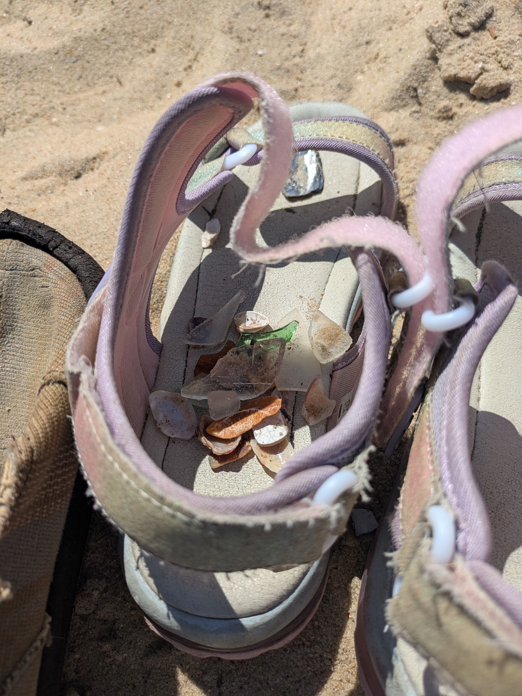
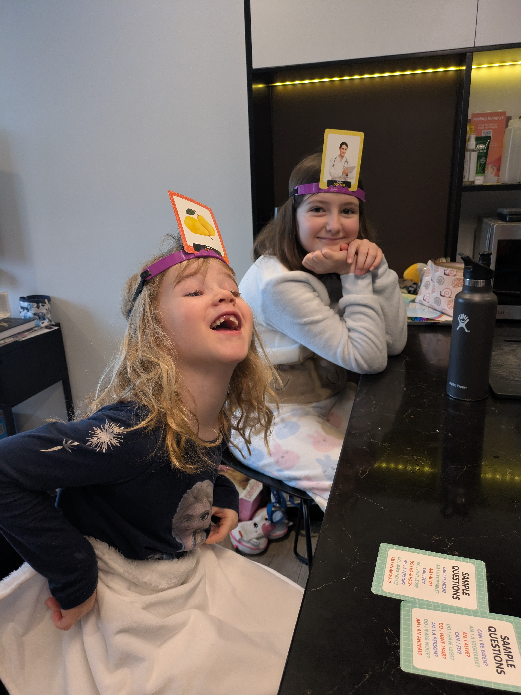
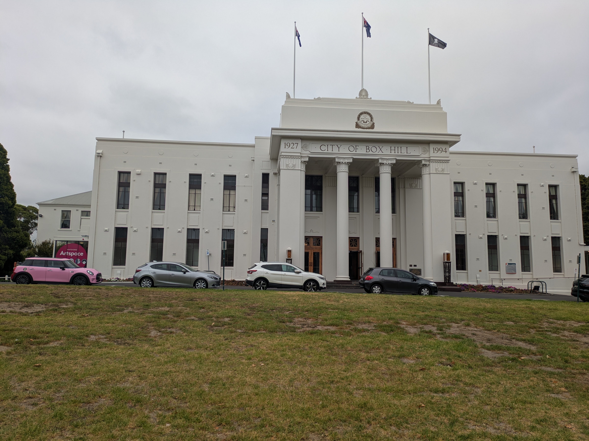
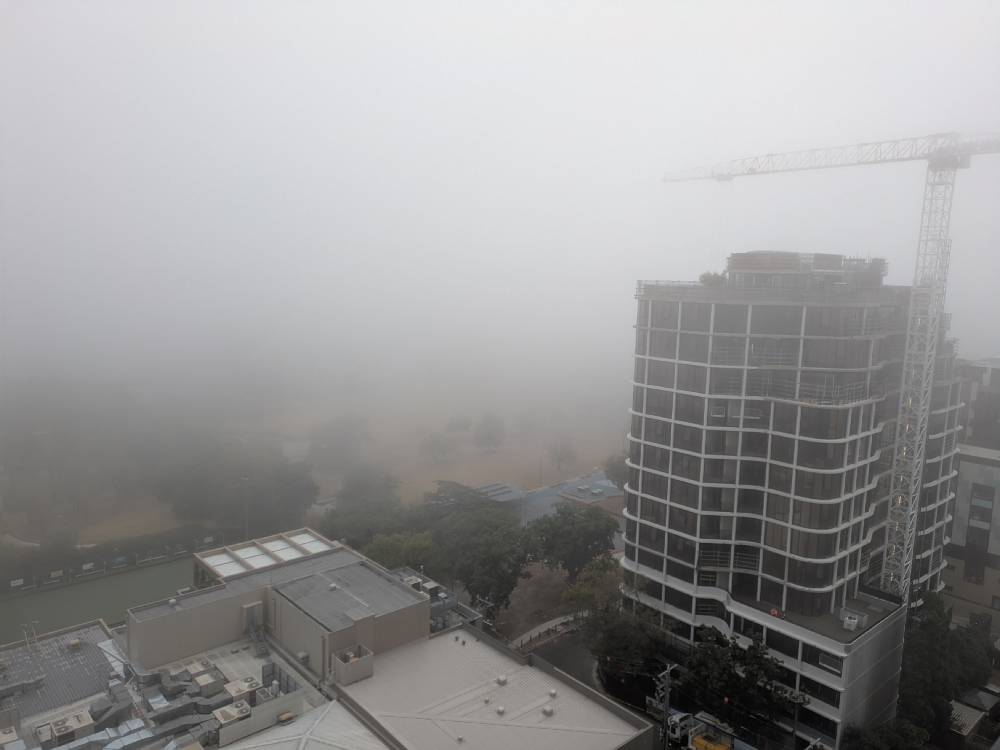

It was bound to happen at some point and Tuesdays are Anna's long day at school so what better thing to do then head to the beach. Here in Melbourne it is St. Kilda beach that is the place to be. As the urban city folk we have become, to get there we had to take the train into town and ride the tram out to the beach. I must say navigating the city by public transport is going quite well and the kids have certainly taken to it. Anyway, the beach. It is a very nice beach. Sandy sand. Warm water. All your typical beach things are present. The only odd thing was that there was nowhere selling ice cream on the beach front. We passed a steakhouse restaurant and an oyster shack, but no ice cream. Do Australians not like ice cream? The beach was still nice and the kids did what kids do at the beach. They splashed around in the water, made little sand castles (with their hands as we have no beach toys) and buried each other in sand. Also, Kassandra gathered up sea glass and now has a small collection of about a handful. With the lack of ice cream vendors at the beach we had to head back in to town to grab a tasty treat before the train home.

## Exploring our local area

After all the fun in the sun we needed activities to keep us indoors. On Friday we get the keys to our new place, which is slightly north of our current location so we headed up that way to Doncaster. We need pretty much everything for our apartment so what better store to go to than Kmart? Yes, that Kmart. The store of my childhood. Same red 'K' in the logo and everything.  The U.S. might be overrun with Target and Walmart, but here Kmart is the place. It is literally in every shopping mall. Oddly enough I haven't gotten around to taking a picture of one them, but it is very much the Kmart of old. Outside of shopping malls we also went to the library in Box Hill and got ourselves a library card. The one here in Box Hill is a little small but the kids found a few books to take home. Next week we will head to the one in Doncaster to see if it's more interesting. But the library membership in Australia certainly comes with some perks. There are several different streaming services included, kids entertainment and learning apps and also news and magazines. It is like a one-stop-shop for all entertainment needs! Oh, and you get to borrow books to take home.

## Getting into the swing of things

This weekend will be all about getting settled in our new place. The kids will hopefully be enrolled in school next week as well. We have seen plenty of kids in school uniforms going home from school and the kids are not enthused by the idea of a uniform. But that is just something they will have to get used to. Hopefully, once they are in school it will be a bit less vacation-mode and a bit more everyday-mode. As Norwegians are fond of saying, it is everyday life there is most of!

