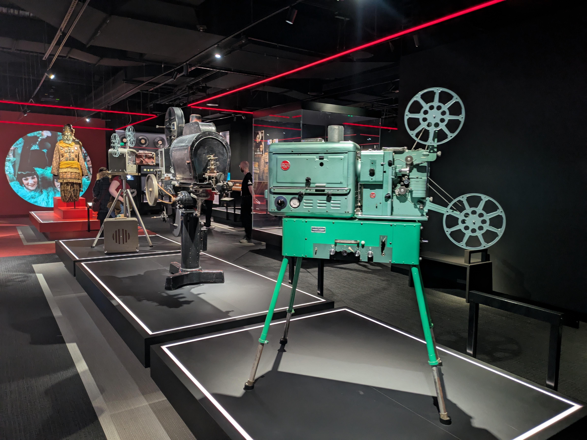

Another term over, another term break is upon us. We have big plans for next week, but for now I need to entertain kids while Anna still has classes. So I scoured the web to find something we could do for the day. Turned out there is a garden downtown that attracts butterflies when 'spring has sprung'. And since spring is in the middle of "sprunging" I figured this must be a good thing to try. Alas, it did not live up to its description.

## Butterfly garden

Heading down to Federation Square we picked up the pamphlet that would 1) describe where to find the garden and 2) show you a selection of butterflies that you might spot. There was also supposed to be a drawing competition, but there was no coloring pencils at the stand. Not a great start. Finding our way out to the garden it was immediately clear that this was not what we had envisioned. There was a medium sized flower bed next to the car park entrance that contained a few samples of indigenous plants. Sadly, there was no information about the plants so we didn't even know what we were looking at. To us it mostly looked like an unkempt flowerbed. We did spot one butterfly, but no of the type that was listed in the pamphlet. Thankfully there was a nice playground below the car park to lift our spirits. There was also a collection of with some carvings on them that kids could climb on. Well, I climbed on them too, so not just for kids. And a few artistic pieces like an elephant and some mosaic. I think those rocks we climbed on were also an art installation, but people clearly used them more for climbing on. Anyway, that saved some of the disappointment of going down town to see butterflies.

## ACMI - National museum of screen culture 

Since we were there we decided to try the museum of screen culture. What the acronym ACMI stands for I still don't know, but it was a nice exhibit of the evolution of the moving picture. From shadow puppets and some really old-school projectors, to movie cameras of bygone eras and a collection of televisions from the 1950's till today. And an installation of video games that you could play! There was some classic arcade style games, like Pacman, and more modern games to play on console or TV. Isabelle and I played a really weird game called Push Me Pull You. There was also exhibits of modern movies and something about documentaries, but at this point the kids were ready to head home. So we headed past the Lord of the Fries (yes, they serve french fries) and caught the next train home.

