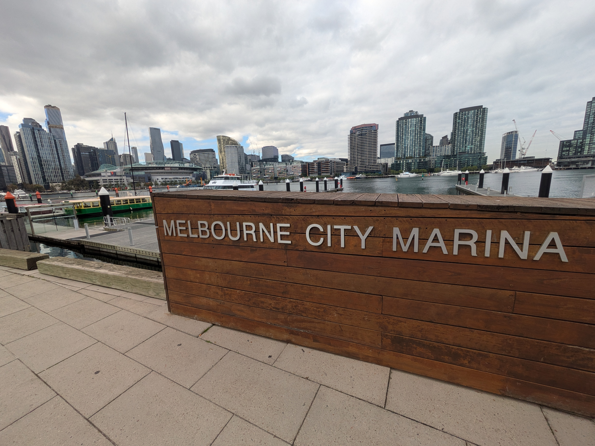

Fall has definitely settled in here. The mornings are chilly, but once the sun comes out it gets warm and sweaters and gloves that were necessary in the morning are overkill when its time to walk home. The question is still whether this is it or if "winter" has more in store for us. Other than changing weather we got our boxes that were shipped from Norway at Easter. The kids certainly had a good time rediscovering toys. And we celebrated Norway's national day, the 17th of May, abroad for the first time. Well, celebrate is a bit of an overstatement.

## Shipping stuff shouldn't be this hard

As I mentioned we got a total of three boxes shipped. After some initial research I landed on UPS for shipping. They have a nice online portal for creating shipments, although if your are shipping more than one box you have to register as a user. Not really a hassle when you have to give them all your personal information anyway, but that could have been a bit more clear at first. Anyway, after having put in all the information and booked a pick-up time I figured that was that. And indeed, they picked up the boxes as ordered, but after waiting for a few weeks I started to get curious where these boxes were. Tracking the shipment showed them having arrived in Melbourne a few weeks after shipping, but the tracking also gave no indication of delivery times. Turns out they needed a B534 form to import personal items into Australia. And since they somehow "did not have my contact info" they couldn't send me the paperwork. Once I finally got the form and filled it in it took about another week and one bill later and they delivered our shipment. All in all, UPS did do their job well, but there was definitely room for improvement. Like if a person is filling in a shipment to Australia online, this B534 being a requirement should just automatically be sent to you. No need to wait for the shipment to arrive in Australia and then find out they need the form. But kudos to the delivery guy who somehow managed to put the boxes in our garage as we were out when he came to deliver them! In my experience delivery drivers in Australia can barely be bothered to get out of their truck so when one of them goes the extra mile that really gets noticed.

## A different kind of 17th of May

This is the first time I have been outside the country of Norway on the 17th of May. Not that I have always taken part in celebrations, but I have always been around. And since the day is mainly focused on kids, once you get a couple of those the day just becomes a competition to see how many ice cream you can eat. Anyway, since it was a rainy Saturday here in Melbourne (the first proper rainy day since we got here), we decided it would be a good idea to go back to the aquarium. Big mistake. Seems like most people in Melbourne decided that was a good idea. This was our third time at the aquarium and I have never seen this many people. Normally you can breeze through the aquarium in an hour, but this time it took closer to two. Could also be that we just hadn't been to the aquarium on a Saturday before. Still, it is a nice aquarium and, as with the zoo, you do get a new experience every time as living creatures tend to not always have the same behavior every day. For us it was a nice day out and I don't think any of us miss having to walk in a parade so that was a nice change from being in Norway.

Some may have noticed a new menu item called "Photos" that takes you to a Google Photos gallery. For now I haven't managed to improve the picture handling on the blog itself so a photo album that gets updated in a case-by-case basis is probably a nice addition. If you'd like you can "join" the album and get notified when new photos are added. For that you will need a Google account, though you can still view all the photos without logging in to Google. I'm trying it out and we'll just see how it goes.

