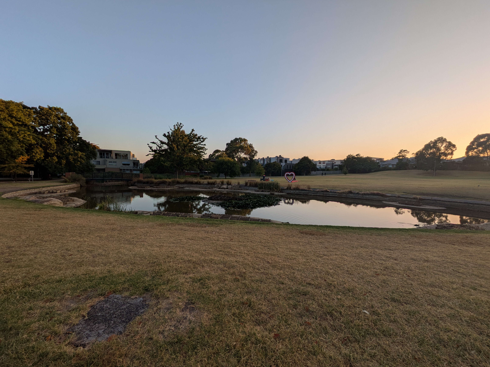

Time does fly! It has already been a week here in Melbourne. We have been battling jet-lag and the heat, but so far we have explored several things that the city has to offer. The local park right next to where we are staying has a great playground and the park is home to many birds. So far we have identified several indigenous birds such as the Corella, Australian Magpie and the Australian wood duck. The Corella is an especially noisy one! As the area is a predominantly Asian and there is a retirement community right next to the park we have also enjoyed watching people practice what we assume is Tai Chi. There was even a group that did it with swords! The park also has a basketball court, ping pong tables and walking/running path. All this and we haven't even left the neighborhood.

## Melbourne Aquarium and Legoland Discovery centre
The first thing we tried was an indoor Legoland. It was a small attraction situated inside a mall. It was a warm day so we need to stay indoors. The attraction itself wasn't much to write about, but they did have a cool exhibit where they built famous landmarks in Melbourne out of Lego. The aquarium had a bit more to offer. Their main attraction are the penguins, but we also saw upside-down jellyfish and a giant ray that was as big as Kassandra! Oh, and a giant crocodile that is over 5 meters long. The crocodile didn't do much so the girls quickly moved on, but the pure size was impressive. Sadly he was in an awkward spot for a picture, but I am sure we will go back as we are now annual pass holders. The aquarium itself was limited in size as it is downtown, but their exhibits were well made and a great focus on conservation.

## I thought summer was over?
Summer is supposed to be from December to February in Melbourne, but so far this week we have had more days than not with 30+ degree temperatures (that's high 80's for all you non-celsius people). That's a lot for us poor Norwegians coming from the depths of winter. Most days we have tried to hide away when the temperature peaks, but today we had to brave the warm weather and go to the Moomba festival downtown, along the Yarra river. They have what they call their 'Birdman Rally' where people jump off a platform and into the river while in homemade contraptions and wearing silly costumes. It's all good fun and for charity. Sadly we were on the wrong side of the river for the best views. But there was plenty of other stuff going on. For the most part we were just trying to keep cool, eating ice cream and drinking slushies. But we did find mini golf in the shade. It was Isabelle's first time golfing! It was great fun so we will have to find a bigger course to try next time.

We also went to check out Anna's school when she was done with class on Thursday. She is settling into classes as this was her first week of full time school. It seems she will be very happy with her courses so fingers crossed it leads to well paying job so that we can remain in Australia for the long-term and I don't have to work (too hard). We have secured an apartment so that we can get the kids enrolled in school and life can become mundane and boring, or at least we can get back to a routine. Right now it feels more like we are on vacation than actually having moved half way around the world. But that might just be the rooftop pool at our hotel that makes it feel like that!

