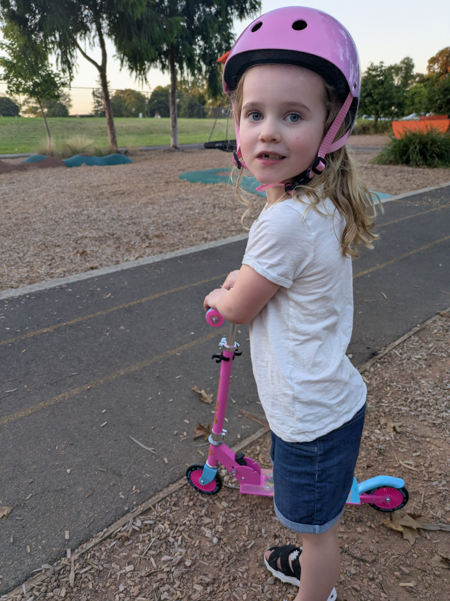
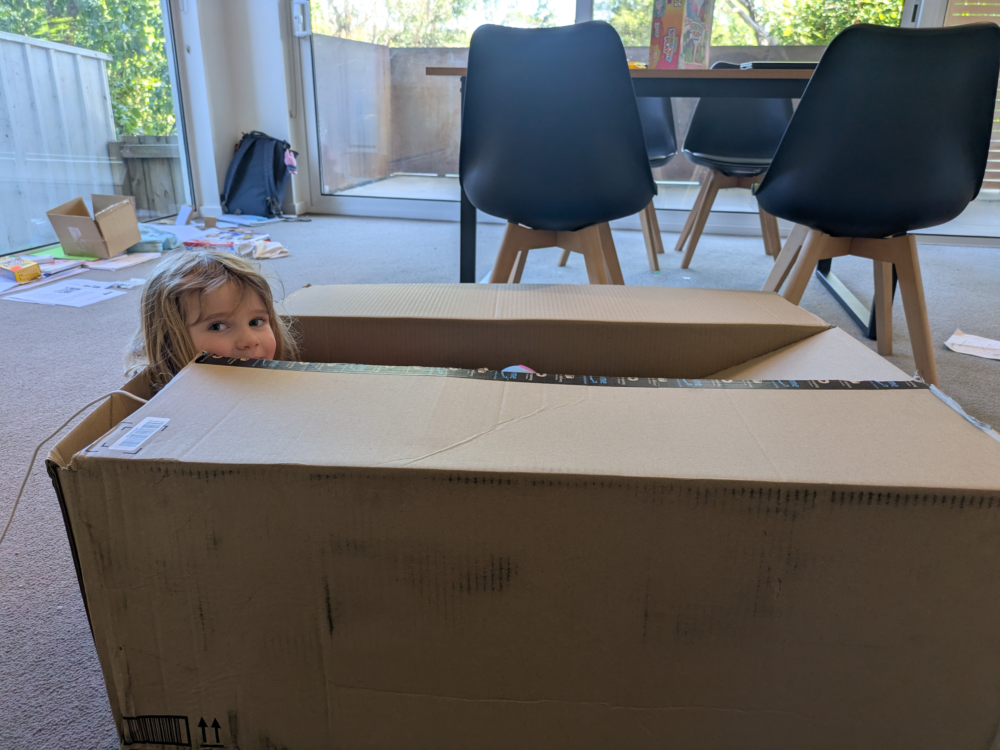

This week we ran out of steam a bit. We had thought the kids were going 
to start school, but some paper pushing bureaucrats decided otherwise. 
That gave them a week to hang out at our new place. And having a 
bunch of deliveries scheduled it was a good thing to hang out at home 
this week. We now have such creature comforts as a washing machine, Anna
 and I have a bed to sleep on instead of an air mattress, and our dining
 table has legs. Things are coming along nicely.

## Role-reversal

Things
 are picking up for Anna at school. Since they work in trimesters that 
means she is about one third through her current courses. She had 
assignments due this week and even though she feels a bit overwhelmed 
she does seem to enjoy her classes, teachers and class mates. I guess 
she will have to share more of her experiences herself. But that leaves 
me to take care of the children and the house. Quite the role reversal 
from the past few years where I was working and she did all domestic 
things. Thankfully we have a non-gender specific term in our household 
so I am now the designated 'house spouse'. A great term that can also be
 used as a verb if you were wondering. I now get to do a lot of 'house 
spousing'. So far it is quite enjoyable.

## Scooter life

Maybe 
the highlight of the week for the kids was getting their scooters. 
Non-electric ones that means they have to kick with their legs. Also, the
 chance of mortally wounding yourself is lower. In Norwegian we would 
call them kick-bikes as we like to call things what they are. But so far
 the kids, especially Isabelle, has enjoyed scooting around the 
neighborhood. It as allowed us to explore the local area more and so far
 we have found an additional five playgrounds to the two we already knew
 about. There definitely is not a lack of playgrounds in this area.

## Last-ditch vacation

To round off the week we did another trip to the 
aquarium since Anna didn't come last time. Their big crocodile was in a 
much better place to view him this time. He sure is big! Overall it 
is a nice little aquarium so we will probably be back again. And what 
vacation isn't complete without some shopping? To not spend too much 
money we checked out some thrift stores, or op shops as they call them 
here. Found a few hidden treasures and got some small things for the 
house for a decent price. Plenty of thrift stores to choose from as well
 so there will be more thrifting in the future, I am sure. Also managed 
to snap a picture of a Kmart finally!

