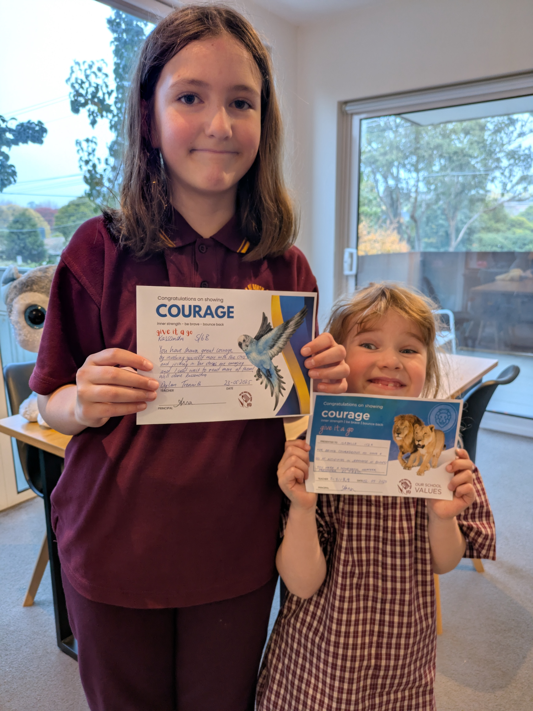

This week we experienced what can best be described as a cold snap. Temperatures were near freezing during the night and the grass was frosty on our way to school in the mornings. And for those of us who like to watch the electricity usage, this week had a noticeable bump in consumption. Not that it will last. Indeed, I am sitting in shorts this morning as I have walked to the library to write this post. This week also had some interesting highlights, like a Japanese festival right here in Box Hill (our area of town). And Isabelle got to go on an excursion with school!

## Courageous girls

Isabelle's class is working on space as a topic and she has already brought home a rocket made of cardboard. But on Thursday her class got to head to Scienceworks downtown. As the name implies it is a science museum, and they have a planetarium where you can watch a recording of the night sky, leaned back in comfortable seats. It sounded like quite the experience so I guess we might have to go there as a family some day to see. Another highlight of the school week was that Kassandra got an acknowledgement of courage. I might have forgot to mention that Isabelle got one of these a few weeks back as well. Basically the school has some values that it wants kids to emulate and kids that show exceptional compassion, creativity, ambition or courage gets an acknowledgement of this at the assembly held on Friday's. And so the girls have each received one for showing courage and participating in class despite being new. Even though there have been some struggles adapting to a new life, they have certainly both been courageous and they both deserve such an acknowledgement.

## Japanese festival 

There was a Japanese festival held right here in Box Hill on Sunday, so of course we had to go see what it was all about. The concept was great, but the amount of people just made it near impossible to enjoy the different things on offer. We got there around 11 a.m. and even then it was already overly crowded. And when we left a few hours later the line to get in was stretching down the block. So very popular indeed, but that meant just trying to walk around was hard enough. It was held in Town Hall which is not dimensioned  for the amount of people participating. Still it was fun to see people dressed up either in Kimono's or a bunch of people in cosplay costumes. The kids recognized some of the characters, but I had no idea who anyone was trying to represent so to me it was just an interesting clash of culture. I am sure if they got a better venue that the festival would be great, but for us it just ended up being too many people.

