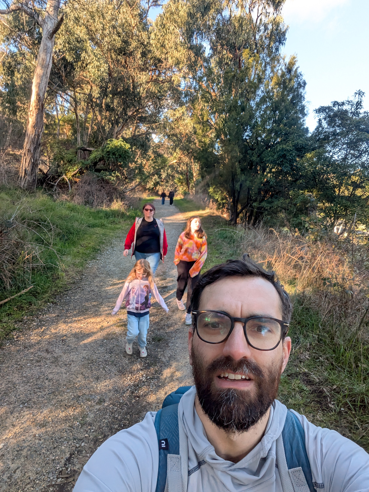

On Saturday we took a hike in the Dandenong Ranges National Park. Just so we are clear, it is not as epic as the name implies. For starters there are no mountains here. The area is certainly hilly, but this park is known for others things then sweeping vistas and breathtaking mountain peaks. For instance, it is home to the Superb Lyrebird. Sadly we didn't see one so you will have to look at pictures online. But the area is also a dense rain forest so the flora is quite interesting for people like us who are more used to pine trees and such. Also, it is only a short ride on the train outside the city so there is that.

## 1000 Steps Walk

Out goal was to do the 1000 Steps, or as it is formally known the Kokoda Track Memorial Walk. Spoiler: there are not a 1000 steps on this trail. Spoiler 2: We didn't actually end up going the steps so we didn't count them and must therefore trust someone else who has done the counting for us. Anyway, the track was adopted by the veterans of the Kokoda campaign from WW2 due to the similarities with the area on Papua New Guinea where this campaign was fought. As it so happens, Army Engineers cut 2000 steps into the track of the Kokoda trail so I guess they felt it was close enough. But the steps in the Dandenong Ranges were actually created before WW2, although the concrete steps of today were put in after the war. And seeing as both sights are a dense rain forest I can see how a soldier who fought in that campaign would consider it a good place to remember his fallen comrades. As with all things war memorial in Australia there are plenty of plaques explaining what happen and at the trail head there is even a decent gallery of images from the time. So even if you don't go on the trail, it's still a nice area to visit with a picnic area, cafe and playground.

## Rain forest on our doorstep

The thing that surprised me the most was that this is indeed consider rain forest. I always associated  the rain forest with areas around the equator. So it was really an experience as I have never been in a rain forest before in my life. It was definitely humid, but with the cooler temperatures of winter still hanging on it wasn't so bad. In summer I can see it being less pleasant with higher temperatures, and that humidity. Before that happens I hope we can make it back again and explore more. This is a national park after all so we just got a glimpse of what is there. But what we saw was fascinating. Trees that barely see sunlight due to the density of the forest and the humidity leads to some interesting fungus growth. I think Kassandra was at times more interested in the fungus growing on the trees than anything else.

## Elusive Lyrebird and other bird life

As I mentioned, you might be lucky enough to see a Superb Lyrebird in the wild. Apparently you'll have to get very lucky for that one. For those that don't know, Lyrebirds are known for their imitation of human noises. Look it up and you will be amazed that what you are hearing is in fact a bird. There was plenty of other bird life to see, but with the density of the forest, trying to take a picture of the birds was near impossible. There was this striking red one that flew around which would either be a Crimson Rosella or a King Parrot. Sadly I was never able to identify which one. But we will be back and maybe try some of the less popular areas. That might bake it easier to observe the wild life.

