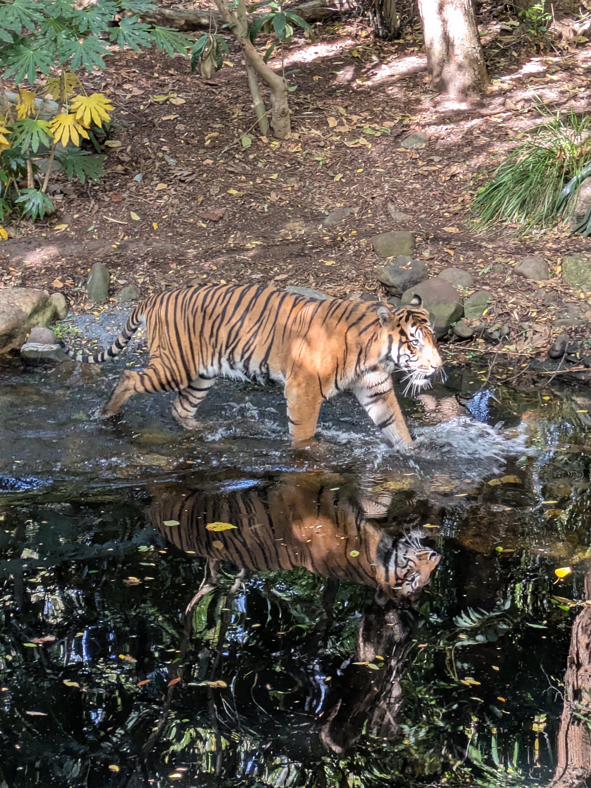

It is funny how a country that is so similar in many ways to what you are used to is also so different. Take Easter for example. In Norway the country basically shuts down (but then again Norway shuts down for the smallest excuse). Here they do have off too, but it is only one day and not everything is actually closed. The funny thing though is that the day that most people have off is Good Friday. I mean, if you want to celebrate Easter I would think Sunday was the day you might want to have off? I guess most people have off on the weekends anyway so the vast majority would prefer an extra Friday off. Being Norwegian we are quite used to having a day each week where nothing is open. And being Norwegian what do you do on days like that? Well, you go outside. And when the temperature is warmer than it should be we figured the beach would be a great place to spend Easter. It seems like that is what a lot of people thought because I have not seen St. Kilda beach more crowded than on Good Friday.

## Vacation, but not...

Having been in Australia now for almost two months it does feel mostly like we are on vacation here. That is probably because the kids have only had one week of school so far. But Anna is busy with her schooling and the past weeks have had several tasks due. So in some ways it feels like we are vacationing in our own home. So with creativity running low on what to do we are mostly repeating things we have already done. Like going to the Zoo again for the third time. We do have memberships to the Zoo so going often just means we get more for our money, but we were at the Zoo last week too. It's okay though seeing as the Zoo is really a great place and of course you can get different animal interactions each time. This time Kassandra had a butterfly land on her hat!

