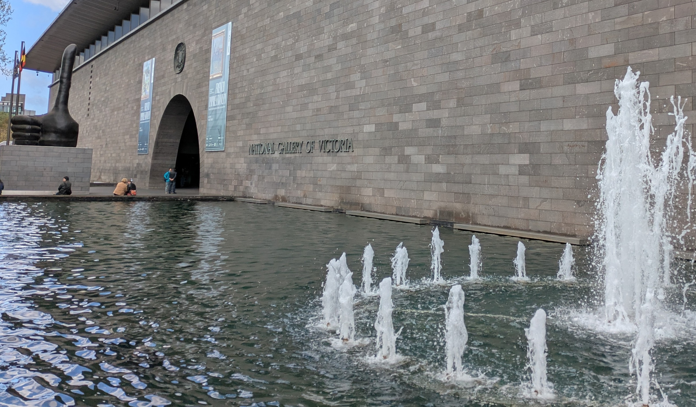
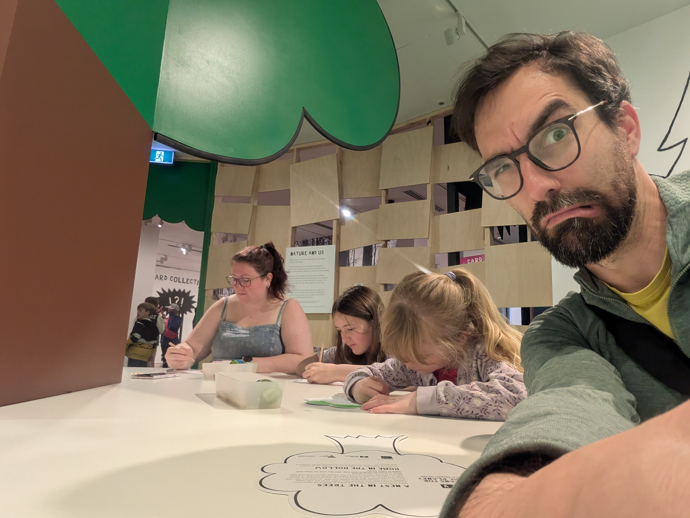

Since Kassandra now has been to three art exhibits without her sister, Isabelle has been begging to go to an art gallery. Of course, she doesn't quite understand that we take Kassandra by herself since Isabelle does not have the patience for something like that. But the NGV (National Gallery Victoria) has a child gallery so we figured that would be the thing to do.

## Water wall at the entrance

One of the coolest features at the NGV is even before you enter. All along the entrance they have a glass wall that has running water coming down. Literally a waterfall along the entire wall! And you can walk right up to it. You could even lean your body against the wall if you wanted, but I guess you would end up wet and that wouldn't be good for viewing more of the gallery. So we all got to touch the wall and then we headed inside. One of the exhibits that Kassandra and Anna went to was the "polka dot lady" (Yayoi Kusama) and they still had one sculpture of hers in the entrance. It's a large octopus shape and kids were running in and around the thing all day long. But we didn't come to run in between some octopus legs so we headed to the children's gallery. It's not a permanent installation and during the term break they had "Plans for Planet" by artist Olaf Breuning. It was a good mix of interactiveness and a message about preserving the planet. Best part was that the floor was a picture of actual lava, with planks set out like a rope bridge to step on. Funny how a simple like stepping from plank to plank makes for a fun experience. We got to try out a photo booth where you could customize your picture with digital props. And then we all colored our own nature piece. All in all it was a great little exhibit that blended art and fun for the kids pretty well. 

We also went in to one of their permanent exhibits of more 16th to 18th century art, but Isabelle quickly found out that art galleries can be dreadfully boring so we just headed out for some lunch after that.

