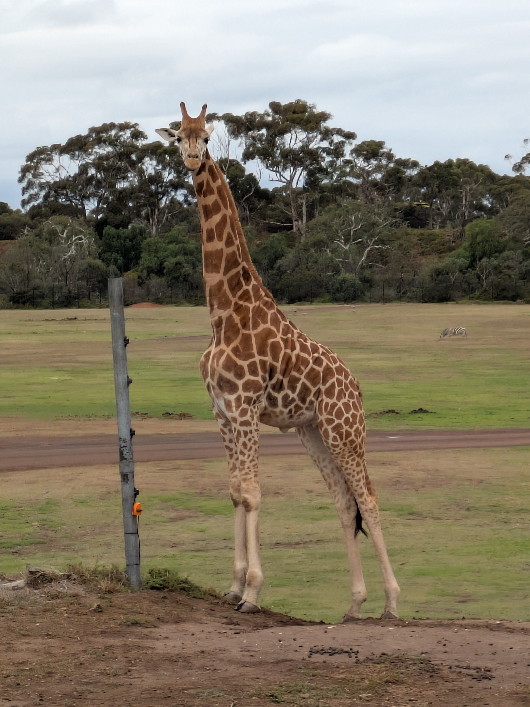

Port Campbell might be the very definition of a quaint seaside town. It 
pretty much has one street where all the shops and restaurants are 
situated, and a few side streets for accommodations. You know it's a 
small town when most things close at 8 p.m. and don't open till 8 a.m. 
the next morning. We found a great pizza and pasta place for dinner even
 though they were swamped so we waited a good while for our food. All in
 all a lovely town well worth the visit.

## Day 3 - Port Campbell to Allansford (and beyond)

Having
 seen a lot of ocean and rock the past two days we weren't really that 
enthused to see even more ocean and rock. We spent the morning at the 
beach in Port Campbell watching the waves break out in the distance. 
Enjoying a slow morning was just fine as there wasn't much left of the 
Great Ocean Road anyway. We should have doubled back to see the Lord Ard
 Gorge, but again, a little tired of rock and ocean. We did stop at the 
London Arch (or London Bridge as it was originally called). A lone rock 
with an arch in the middle was an impressive sight, but it would have 
been even better had the original second arch been there that connected 
it to the mainland. Sadly that collapsed way back in 1990 so now you can
 only look at the arch and not walk onto it. After that we checked out 
the Grotto, but this one I think required precise timing for the best 
experience. The Grotto is just a hollowed out section of rock and pools 
of water that are filled by the waves crashing in. But if the tide is 
not high then the waves don't quite reach so it's a little underwhelming
 if you don't get the timing right. We did get a few splashes that 
reached just enough to see, but again, the tide needs to be at it peaks 
to get the benefit of water splashing over the edge. One last stop at 
the Bays of Islands for a few more views of rock and ocean and we were 
done. The last half hour of the road could just have been skipped. So we
 just got back to the highway and headed for Geelong.

## Day 4 - Geelong and the Werribee Open Range Zoo

Being
 a good portion smaller than Melbourne, Geelong is still a nice looking 
city. We found a great Mexican restaurant for dinner that had pretty 
authentic Mexican food. We walked along the waterfront in the morning, 
played at a playground and got to say hi to some dogs. There is a boat 
from Melbourne so we will definitely be back to explore this city more. 
But we had another place to check out before going home though so off we
 went to the Werribee Open Range Zoo. This zoo is run by Zoo's Victoria 
who also run the zoo in Melbourne so our zoo membership gives us free 
access to this zoo as well (there are 4 zoo's in total across the 
state). As the name implies this is a larger zoo with big enclosures so 
the animals can roam free. Their new Elephant Trail had just opened 
giving plenty of space for their nine Asian Elephants. Being larger 
enclosures this isn't the zoo for up close and personal experiences, but
 it was still impressive seeing the elephants even from a distance. We 
caught the safari bus that drives you around big open enclosures with 
many different animals. The ostriches were especially funny as they 
liked to stand close to, or in the road, causing a slowdown in traffic. 
There were so many animals it would take too long to list them all here.
 If you have the opportunity you should go see them for yourself. But to
 conclude the Open Range Zoo is a great compliment to the zoo in 
Melbourne so we will be back to check out the rest as we sadly did not 
have the time to see it all.

Thankfully afternoon traffic seemed 
to have died down by the time we rolled back into town. A wonderful long
 weekend with lots of new experiences. It was good to see more of the 
country and not just the city of Melbourne. We will definitely have to 
get out of the city more and see what else this country has to offer.

