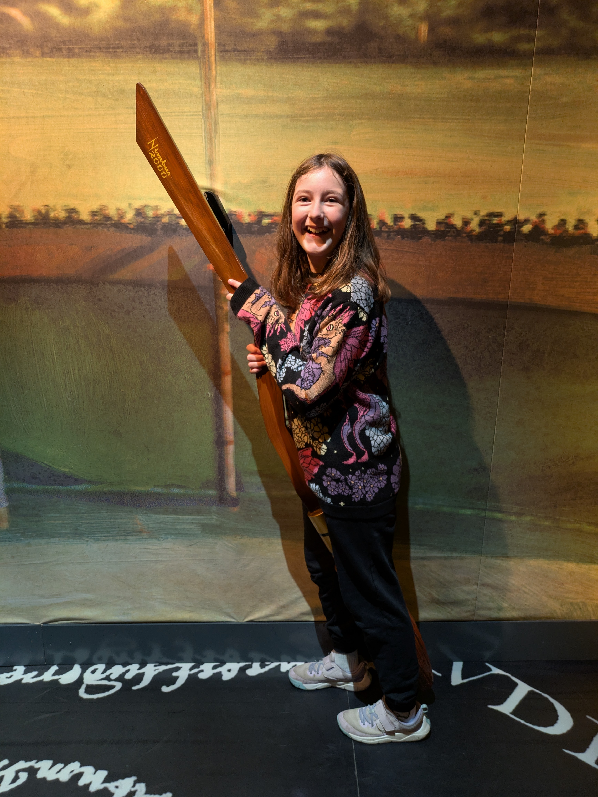

To round out the week we headed to the Harry Potter Exhibition in North Melbourne. It's an exhibit that I would call part museum and part interactive experience. It's not a permanent installation, although it has been here for as long as we have and doesn't seem to be going away any time soon. Anyway, we all had a blast experiencing key moments in J.K. Rowling's universe (it also featured some parts from Fantastic Beasts).

## Interactivity for the kids

As you enter you received a wrist band with a chip. Before the whole thing started you got to make a profile, including choosing a house. Of course, most of us would probably choose Griffindor, but Kassandra was adamant about being in Ravenclaw. Naturally as you went through the exhibit you could earn points for your house. There were activities like brewing a potion, or casting certain spells, or even re-potting Mandrakes! All done via a screen, but I would say that did a fair job in engaging visitors, especially those a bit younger.

## Memorabilia for those a bit older

As for us who grew up with Harry Potter in the books and later the movies, they had a bunch a things that you could envy. Like a first edition of the first book prominently displayed in a "vault" with the door looking like Gringotts vault 713. But most of the artifacts came from the movie, showing full costumes from the characters and extras or key pieces from the film. I liked the Sword of Griffondor and Hagrid's umbrella. Just like a museum they had these displayed in glass cases with small plaques describing what and how it was used. But unlike a museum the information was just enough to keep you interested, but not so much that the kids would whine about having to wait for you. I think a few museums could really learn from this.

So if you are a fan of Harry Potter and this exhibition comes to a town near you I would say it is well worth a visit.

