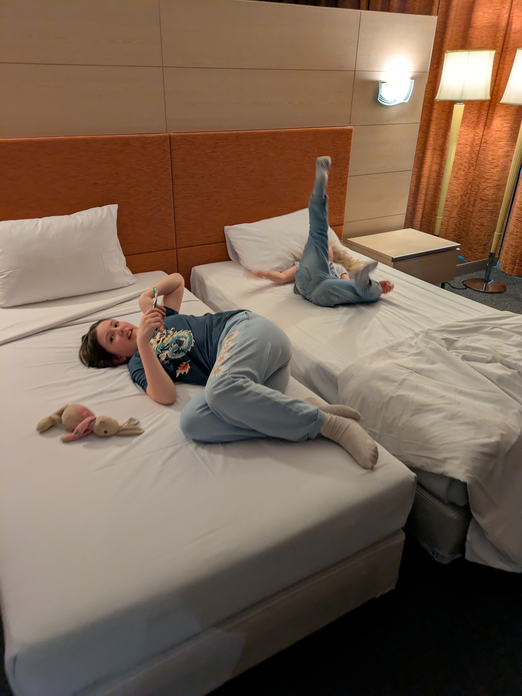

The days is finally here. It's time to pack our bags and head Down 
Under. Some tears were shed as we made our goodbyes, but we are leaving 
with blessings and love. Everyone has said we are crazy and/or brave for
 doing this. Some have expressed jealousy (but in a good way). It is 
clear that most people think of doing something like this - packing up 
and exchanging your life for another. It is also clear that most people 
leave it at that. A thought and no more. I guess we are both lucky and 
privileged to be able to do this. Alright, enough moral philosophy. 
Let's see how we got on.

## Part 1: Oslo to Bangkok

Going 
halfway around the world is far. But the flight path from Oslo's main 
airport, Gardermoen, is actually not that bad. Just one connection in 
Bangkok. But that means two flights of around 10 hours each. My father 
was kind enough to drive us to the airport and help us inside with our 
luggage. The drive went smoothly although Isabelle does get horribly car
 sick. Thankfully we know this and we come prepared. Two throw up bags 
were tossed in the garbage when we parked. Check-in went as well as can 
be expected. There was a tour group in front of us that made it a bit of
 a wait, but once they got going it was a breeze. We concluded that 
travel is mostly just waiting. Waiting to check-in. Waiting to go 
through security. Waiting to pre-board your flight. Waiting to board the
 flight. And finally, waiting to take off. Oh, and currently we are 
waiting in the Bangkok airport for our next flight.

For now we are well on our way and things are going pretty well. One down and one more to go ✌️

