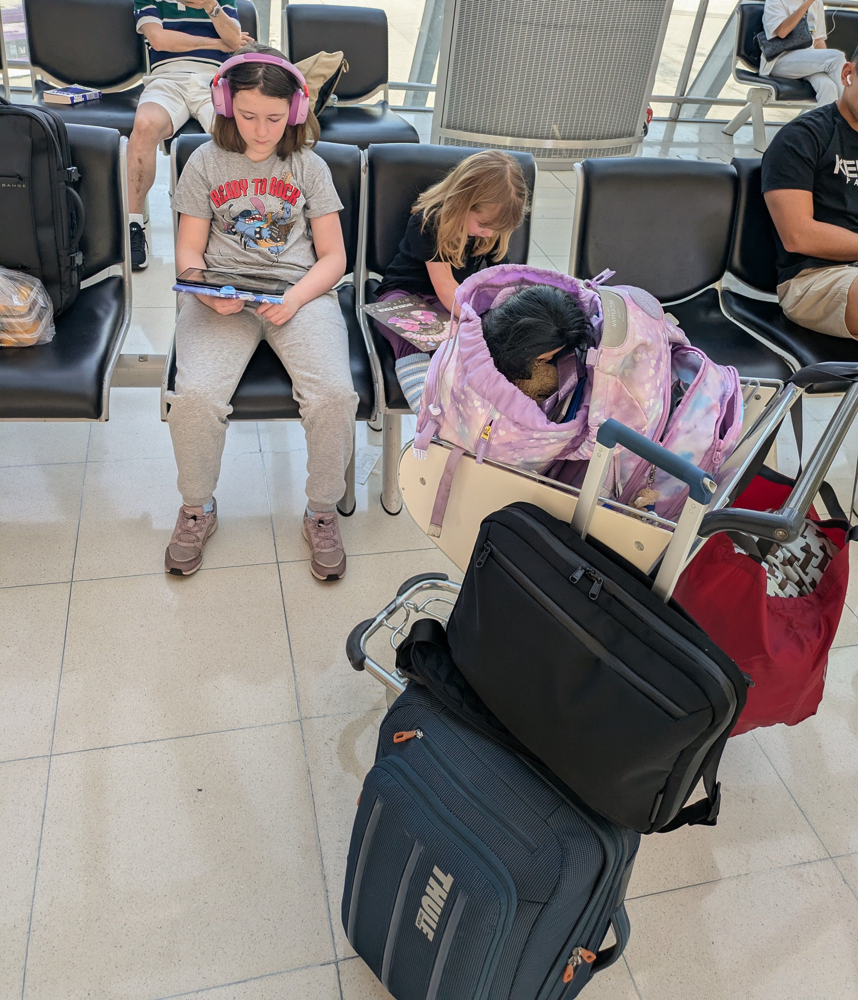

Having had a long but otherwise uneventful flight from Norway we found 
ourselves in the Bangkok airport with time to spare. 12 full hours of 
time to be exact. Knowing that we would be landing at midnight Norwegian
 time I figured we would need to get some rest and so I booked a transit
 hotel situated in the International Terminal. After some initial 
trouble finding the place we did eventually have to cross the whole 
airport to get there. The girls did admirably given that they were tired
 and had heavy backpacks full of toys and books. The Miracle Transit 
Hotel lived up to its name. With 6 good hours of sleep we felt well 
rested and ready to take on the next leg of our journey.

## Part 2: Bangkok to Melbourne

With
 one long-haul flight behind us, and knowing that the next one would be 
almost two hours shorter I felt confident. After leaving the transit 
hotel we had a few more hours to kill and with no gate yet we aimlessly 
wandered, checking out the airport. We eventually sat down in some seats
 at outskirts of a shopping area. When the gate finally came up on the 
board it turned out we had sat down just a short walk from where our 
flight would be departing. And so we got some fruit, drank what water we
 had as they don't let you bring any on to the plane, and walked the 
short distance over to the gate. Again, waiting was the name of the 
game. But finally all the waiting was going to pay off. We got on our 
flight, which again was rather uneventful, and we finally touched down 
in Melbourne this morning.

Anna met us at the airport as she 
didn't have class until this afternoon. She organized transport for us 
and we all got in a van and off we went. Even though just getting here 
had some finality too it, now is truly when the adventure begins!

