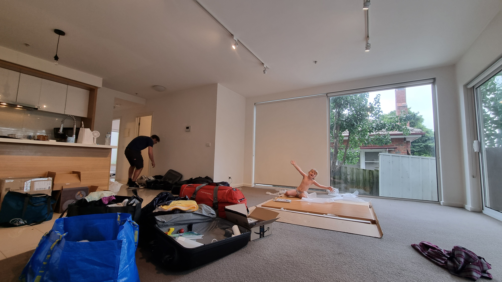
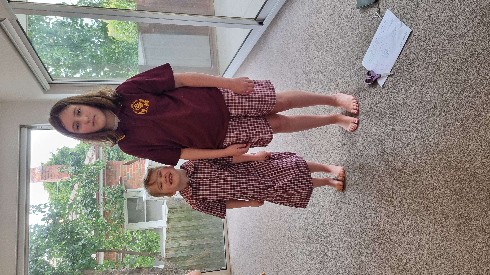

This was our last week at our hotel which means we had to say goodbye to the rooftop pool. Which is fine as the weather is starting to turn. Fall is definitely here as mornings are cooler and the highs are now only in the low 20's (70-ish Fahrenheit). Looks like we still might get some days with higher temps, but I guess Melbournians would still define this as fall. For us it feels like a decent summer day so we are quite happy with the weather now.

## Moving into our new place

We got the keys to our place last Friday, but we needed to set up things like electricity, gas and so on. Also, there was no furniture so we had to get the basics before we could actually spend our time here. We have had a week of shopping everything from beds to cutlery. We even did a trip to IKEA! Their meatballs taste just like home, the big difference is that IKEA is not the cheap options here in Australia. For now the apartment looks like we just moved in because we still need a bunch of stuff and we are still living out of suitcases, but with a 'permanent' address we also can get the kids into school.

## School uniforms are not cheap

So on Friday we had orientation at the kids new school: Box Hill North Primary. Kassandra will be starting Year 5 and Isabelle will be in Year 1. It seemed like a nice school and the building for the Year 1-4's is actually less than a year old. Isabelle got to say hi to her teacher while Kassandra only got to peak in through the window as her grade was off on some excursion. They will start school on the 31st of March and since term ends a week later they get one week of school then two weeks of vacation (again!). But at least they get a week to get to know their new classmates, teachers and how to get to and from school. We did get school uniforms while we were there and let me tell you these things are not cheap. Coming from a country where public school costs nothing it certainly feels expensive. But you can get used items so we did save some money.

## Trip to the Zoo

We ended our week with a trip to the Zoo. The Melbourne Zoo is definitely something I would recommend and we will be sure to visit again soon. We had some amazing animal encounters including close-ups with Emus, Giant Tortoises and a Pygmy Hippo! Also, this must be the first Zoo that I have been to that has their own line of coffee. I even bought a bag of coffee beans at the gift shop when we left.

