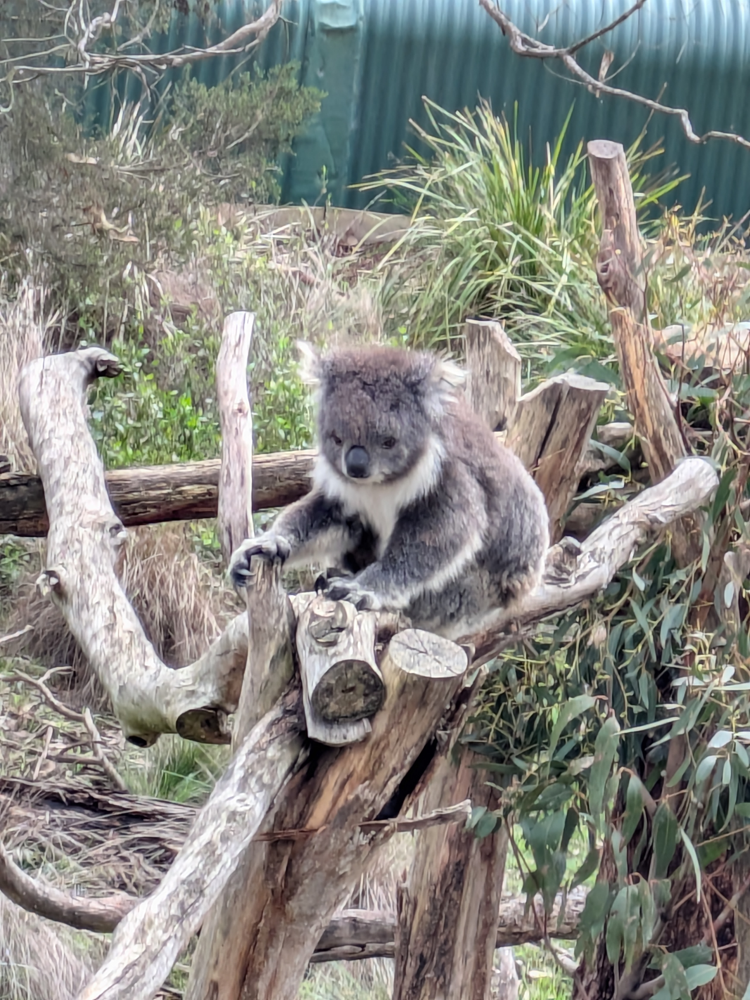
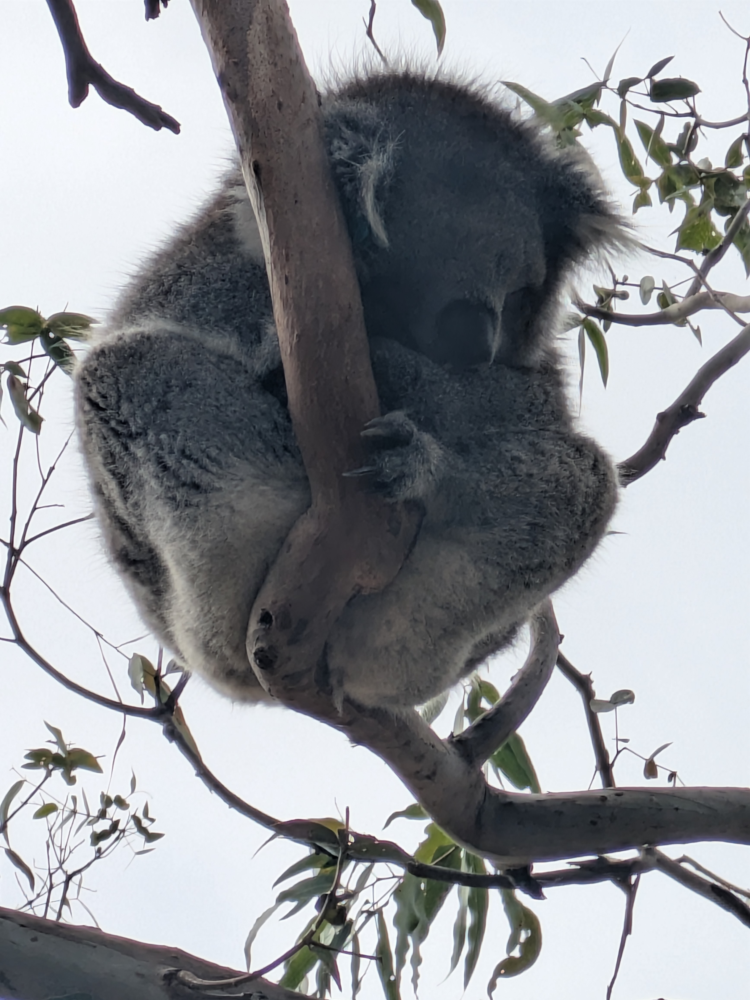
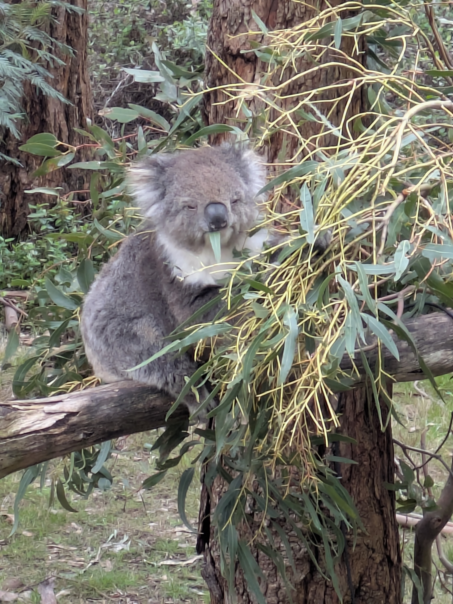
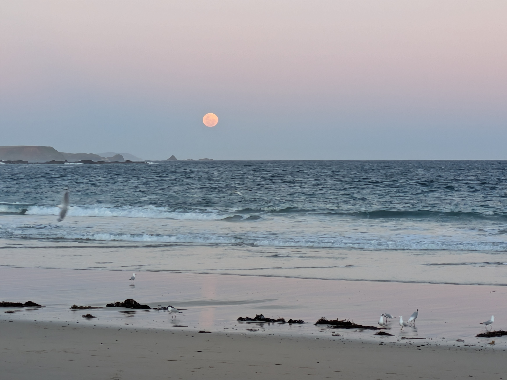

Our first (and possibly only) visitors arrived this week. Thamsyn and Cat made the arduous journey from the States all they way to Australia. With an almost 15 hour flight from San Francisco to Melbourne it must be one of the longest airplane rides you can take. Not to mention the domestic flights just to get to your transpacific one! Anyway, they arrived safely and once they get over their initial jet-lag it was time to head to Phillip Island. Since the famous penguin parade needs to be booked weeks, or even months, in advance we had put this off until their visit. And since there is more than just the penguin parade to see on Phillip Island this is going to be another two-parter.

## Koala Reserve 

Heading down to Phillip Island on Thursday evening, we had waited till the kids were done with school for the day. And seeing as our tickets for the penguin parade were on Saturday we decided the Koala Reserve was a good place to start. It also happened to be just up the road from our accommodation. Mind you, Phillip Island is not very big so nothing is really that far away from anything. The Koala Reserve is as the name suggests, a reserve for Koalas. Some Koalas are rescues from bush fires, others are just displaced due to human activities (deforestation). But as the Visit Victoria website put it: "...elevated boardwalks bring you closer to the koalas as they go about their daily business of sleeping, eating, and sleeping some more.” So lots of sleeping Koalas or, if not asleep, eating. There was one guy who actually walked along a branch as we watched so they do move. At least every now and then. In general it was a better experience then seeing Koalas at the zoo. These are wild Koalas after all and the habitat is left as natural as possible. Minus the board walks of course. There was also at least one Wallaby and some birds that I don't remember the species of. Basically they tend for indigenous animal that needs looking after for whatever reason. So definitely a good start to our trip!

## Penguin Parade 

Next day it was time for the big to-do! Seeing as the penguins don't "parade" until after sunset we had time to waste in the morning. First off, the penguins don't do an actual parade as Isabelle thought they would. They do however come up out of the ocean at a predictable time each day as they their burrows are between the rocks and bushes along the coast. See, the penguins of Phillip Island are called Little Penguins. They happen to be the smallest species of penguin in the world. And because they are small they are susceptible to be eaten by most other creatures who like to eat other creatures. To avoid this they have very cleverly figured out two things: birds don't hunt at night and the ocean is blue. To start with the second one first, these penguins are also known as Blue Penguins, due to the fact that their backs are a deep blue color. It makes them practically invisible from above when swimming in the ocean. And the first one, the fact that birds of prey don't hunt at night, means that they wait till nightfall before returning home. Not that they are nocturnal, but as long as they either stay hidden in their burrow or are our at sea during the day, they are much less likely to be eaten then if they wonder along the shore in sunlight. That is why this whole "parade" thing works. Although the numbers vary, generally you are guaranteed a few penguins returning home each night. Theoretically you could have no penguins returning home as they can also sleep out on the ocean, but I assume that is a very rare occurrence. If that happened too often this wouldn't be the tourist draw that it is. Because it is a very touristy attraction. There are boardwalks and a large visitor center with cafe and restaurant, and of course gift shop. It's quite the setup, but seeing how many people attend the place would be ruined if not for the infrastructure and guidance of the people running the place. All in all, we got to see some penguins up close and I guess that is what counts.

