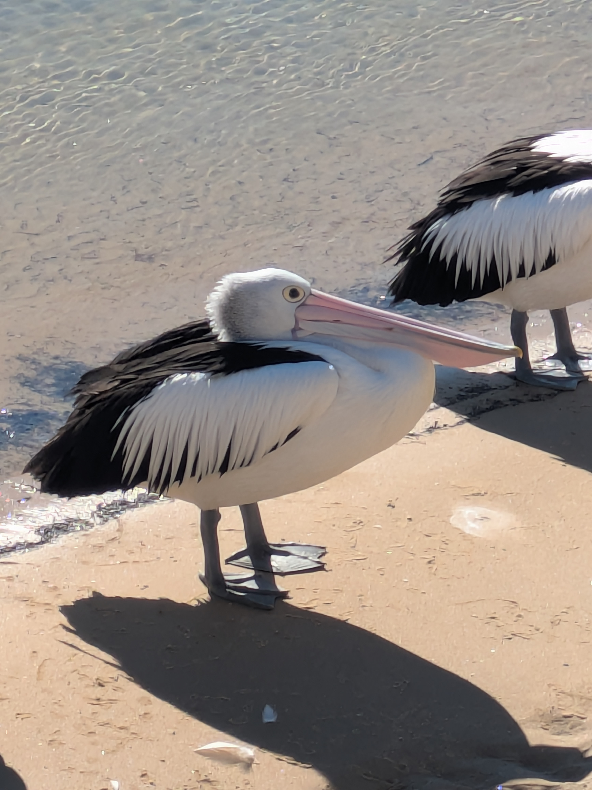

Phillip Island is so much more than just the Penguin Parade, although that is what it is known for. But the island is home to a lot of wild life. Indeed, there are other penguin colonies on the island other than the one where they have built up all that infrastructure, but I assume those colonies are smaller and harder to find. I believe there is actually a colony of penguins down on the St. Kilda beach somewhere. For those who don't remember, St. Kilda beach is the go-to beach here in Melbourne. I have a few posts from this spring about it. Anyway, back to Phillip Island. Like I said, plenty of wild life. We rented a cabin at a camp site and there one of the first things that greeted us when we arrived were a bunch of bunnies. Or probably rabbits. I'm not sure what the difference is. Also, in the morning a bunch of Australian Swamp Hen would congregate around our front porch. I guess they were looking for food scraps. One morning there was even a duck which seemed like he wanted to come inside. So not all the wild life is afraid of humans.

## Churchill Island

Included in the package deal to see the Koala Reserve and the Penguin Parade is access to Churchill Island. More correctly, you get access to the farm on the island. It is a working farm with cows, goats, chickens and more. But they also have a few exhibits of early settler life from the people who initially started the farm. Also, there was a mansion built by some rich guy from Melbourne who bought the farm at one point and used it as a holiday home. So it's a farm/museum I guess. They have demonstrations of activities like black smithing, sheep shearing and sheep dogs herding sheep. Personally, I took a walk around the island in the afternoon. It was just over 4km (2.5 miles) around the whole thing so not a huge island, but the walk was scenic with the ocean on one side and the animal enclosures on the other. Another nice outing to round out our trip.

## Pelican feeding

On Monday morning it was time to check out and head home, but not before we headed over the bridge to San Remo and went to see the pelican feeding they do each day at noon. We had lunch at the fishermen co-op and enjoyed authentic fish and chips. The fishermen co-op are also in charge of the Pelican feeding as it has sort of just become a tradition. But now they focus more on conservation than just throwing scraps to the Pelicans. They monitor the pelican population based on the number of birds that show up. And show up they did! Even before we had lunch there was a decent group hanging out on the beach. And that group just kept growing and growing until they rolled out the fish. I've never seen a pelican before, but they are interesting birds to say the least. Not only how they can open their mouths, but also just how they look with their long beaks. I've seen pictures or depictions of pelicans, but seeing a flock of them up close was something else. If you ever find yourself near Phillip Island a short stop to see the pelicans is well worth it just for the novelty alone.

And so we headed home after an action packed long weekend. I will add that we were extremely lucky with the weather during our stay on the island. We even had a full moon on the night of the Penguin Parade! Just as a reminder August is still a winter month here in Australia even though glimpses of spring due appear. And so we should count ourselves lucky that the weekend turned out as nice as it did.

