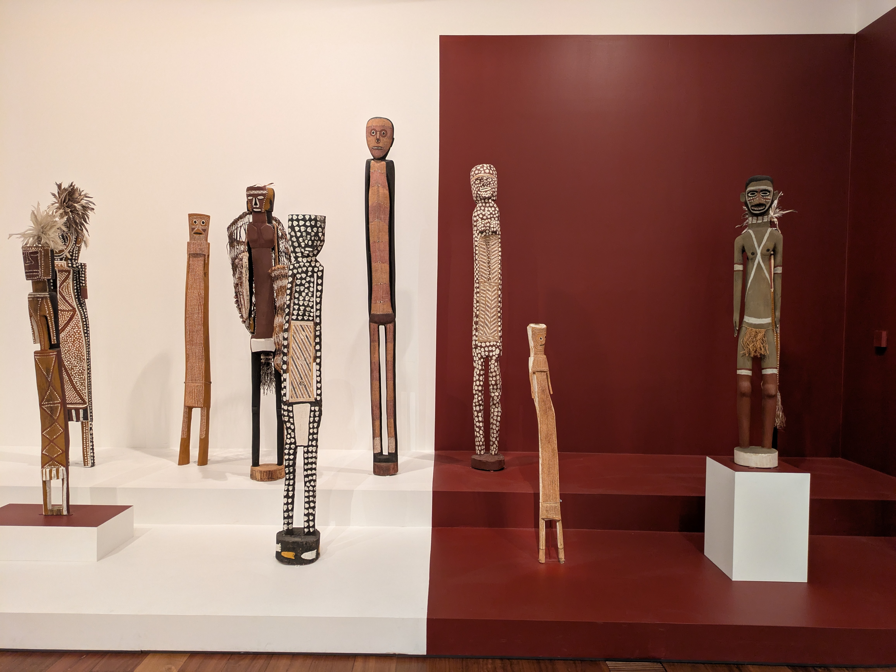

Seeing as I have not quite kept up with writing blog posts every week like I intended I thought I would try to write when inspiration hits, or when I feel I have something to interesting to write about. Like how Kassandra and I skipped school yesterday and took the day to view some indigenous art. I will add that Kassandra's class had a basketball tournament this day. And seeing as Kassandra is not a big sportsperson I felt the $20 would be better spent doing something else. So we headed downtown to view some Australian art.

## Ian Potter Center

The National Gallery of Victoria (NGV) has two sites in Melbourne. The main one generally houses the more exciting exhibits of guest artists, but the Ian Potter Center has a permanent exhibit of indigenous and Australian art. The exhibit contains three galleries (on separate floors) and shows indigenous art without a big focus on time period. It mixes both historical and modern indigenous artists. There was a lot of focus on the struggles of the locals during colonialism and its affects today. But there was also a nice exhibit showing traditional bark paintings and bark baskets (yes, you had to pimp up your basket back in the day). On the second floor there was an gallery of 19th artist. This included both indigenous art and colonial Europeans who depicted what they saw while settling in Australia. Lastly, there was a 20th century till modern day gallery showcasing again a mix of both indigenous and, for lack of a better word, white artists. When it came to the contemporary art there wasn't as big a distinction between native and non-native artists anymore. But seeing the 19th century art side by side it was clear which was which.

All in all a nice little day out. Kassandra gets a lot more out of an art gallery than a basketball tournament so for me it was an easy choice to let her skip school in favor of something we could enjoy together.

