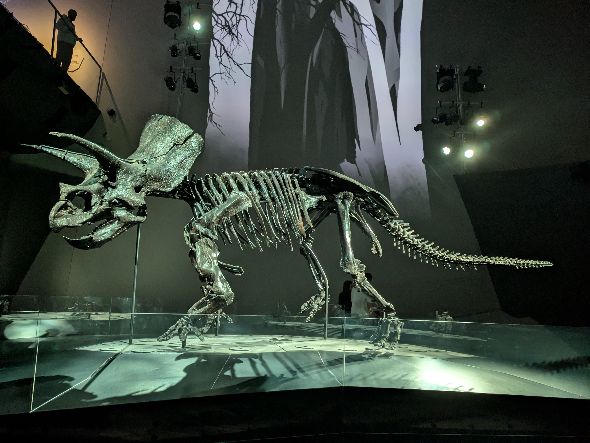
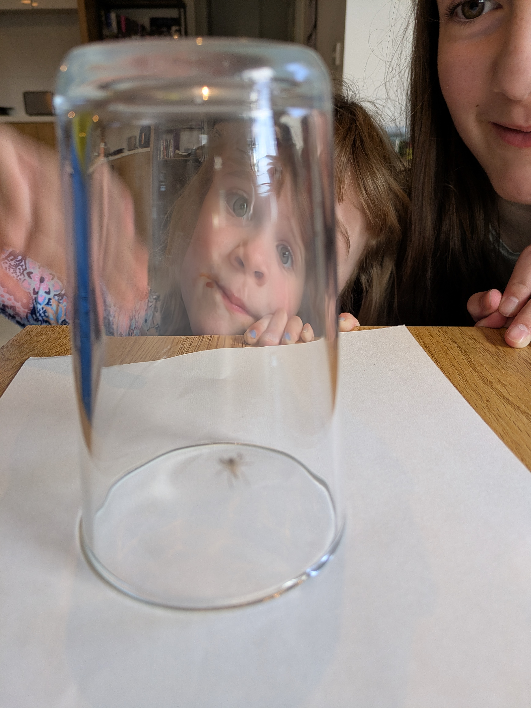

Forgive me that the blog has not been updated in a while, but I did start writing the draft for this post weeks ago. This will therefore be more of a summary post of what happened in November. As I'm writing this it is has now been confirmed that November 2025 is the wettest November in 30 years. And December 1st is also the coldest start to summer (gotta remember we are in the southern hemisphere) in over 30 years. So not a great spring so far, and not a good start to summer either. With all the wet and unstable weather that just means more indoor activities!

## Melbourne Museum(s)

The kids have both taken excursions to Scienceworks with their school. As the name implies, it's a science museum, but it's connected to the Melbourne Museum which consists of three museums in total. And since a family membership is fairly cheap we decided to try them all out. Starting with Scienceworks. The kids showed us their favorite exhibits, from conservation efforts to how electricity works. On the grounds was also the first pump station for Melbourne's sewage system. Not sure the kids found that so interesting, but they had working pumps and some history of the creation of plumbing in the city. Personally, I found this to be the best part. All in all a good museum, but it was starting to show signs of wear. Probably from all the school groups that come through. But the kids really enjoyed it and it was pouring rain outside so it made for a good Saturday activity.

## Dinosaurs at the museum

The next weekend  we headed to the Melbourne Museum. Yes, the one actually called the Melbourne Museum. As the technical umbrella term is Museums Victoria I guess it's not to terribly confusing having a museum called the Melbourne Museum. They had a great exhibit on Dinosaurs, with many partially completed skeletons. The prime specimen was the Triceratops skeleton which was mostly intact. Of course, they had all the information about different dinosaurs and theories about how they went extinct. There was a section on climate change, mostly through the eyes of history and how the Earth has evolved over the years. They also have a nice garden exhibit called the Forrest Gallery, showing native plants to the region. That's all we got up to that day, even though they had nice looking exhibits about Vikings and First Nation people. But there is only so much museum the kids can handle, especially when it's a little less hands on type of exhibits.

Other than getting out (or in?) on the weekends life has consisted of trying to get back to normal. Getting over jet lag, getting back into routine with school and homework and dinner. November didn't really shape up to what we had hoped mainly due to weather, but our time in Australia is running out. We have decided we are not staying here next year. One big factor is of course Anna having to delay graduation due to her father's unfortunate passing, which delayed the job hunt, which delayed our visa extension and so we have somewhat given up that we can find a way to remain. But as I've touched on before, Australia is just so far away from everything else in this world that it might as well be on another planet. And with Anna's mother now a widow we would rather live a reasonable distance away to spend more time with her and other family.

