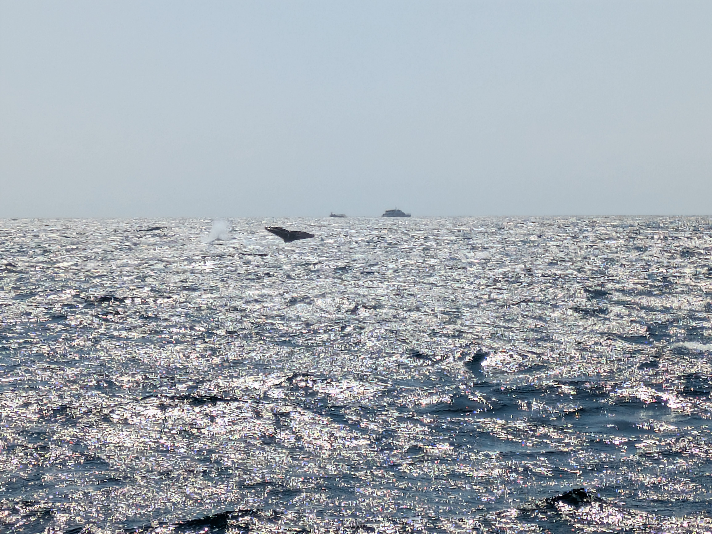

First full day in Sydney and we were starting with a bang. Or at least a morning whale watching cruise. We didn't have as much time to enjoy the hotel breakfast as the boat was leaving at 9.30 and we still had to figure out getting around Sydney by public transport. Thankfully figuring out what mode of transport to use and what line to take isn't hard, but Sydney's "opal card" system for kids wasn't as straight forward as the "myki card" version here in Melbourne. That is to say that the physical card was sold at only a limited selection of retail stores, while in Melbourne you can buy the card from any ticketing machine. So we ended up grabbing one-time tickets for the kids and as for us adults, we just use our phones as you might expect.

## Whale watching is actually fun

We still got to our boat with time to spare. The Circular Quay is located right between the Sydney Opera House and the Harbour Bridge, so as we headed out into the Tasman sea we got some nice views of the city's most iconic structures. The inner bay was fairly nice and quiet, but once we rounded the cliffs into the open ocean it was clear this was going to get rough. Thankfully the captain spotted a pod of whales right as we came into the open and so we followed this pack for the entire cruise. The reason whales congregate out in the sea on the Eastern side of Australia is because that is the largest migration of Humpback whales in the world, closely followed by the west coast and along the coast of New Zealand. But in any given year over 50.000 whales will migrate from Antarctica to warmer waters where they have their young. As the captain explained, the baby whales would freeze to death if they were born in the southern ocean. So the whales have to swim 5.000km just to mate and have their young. And then of course they have to swim back down again. Currently the whales were making their way home to Antarctica. Now just imagine bobbing up and down in the swell of the ocean for an hour and a half just watching these whales do whatever it was they were doing. Not hard to see why poor Isabelle got seasick. Thankfully the boat was well equipped with puke bags, which is a good thing because she threw up a total of three times. So a little damper on an otherwise quite enjoyable time.

## Sydney Opera house and Botanical gardens

After having said goodbye to the whales we headed back to shore. Like I mentioned the opera house is right around the corner so naturally we had to check it out. Honestly the opera house is almost better view at a distance because those iconic "orange slices" are not as impressive up close. They kind of loose their whole architectural uniqueness when viewed from directly below. So we made our way through to the botanical gardens to enjoy the greenery. Now some might know about the Australian White Ibis, better known as the bin chicken. This interesting looking bird has taken up residence in the botanical gardens in Sydney. In fact, it got so bad a few years back that they culled the population. Sadly, it is not the birds fault. The White Ibis is a wetlands bird who would much rather prefer a nice swamp to city life, but of course we humans have encroach on their lands. Diverting water for farming and drying up their natural habitat. The bird has been too successful in adapting to modern human life and so they are not endangered in any way. Which is just doubly sad, given that they are viewed as a nuisance in the city, but we also took away their land so they can't go back. And not being endangered doesn't exactly help with conservation efforts. So this poor bird is doomed to a life of adapting to a world where humans write all the rules. At least the botanical gardens are nice.

## Dinner alfresco  

For dinner this evening we decided that we wouldn't even bother with sitting down at a restaurant. We headed back to Tumbalong Park and got takeout from the different places around the park. That worked great! The kids got what they wanted and Anna and I could explore more exotic options. And there being a nice playground right there meant we could all enjoy another warm evening in Sydney. Of course we topped it all off with an ice cream before it was back to the hotel to get some sleep before another exciting day.

