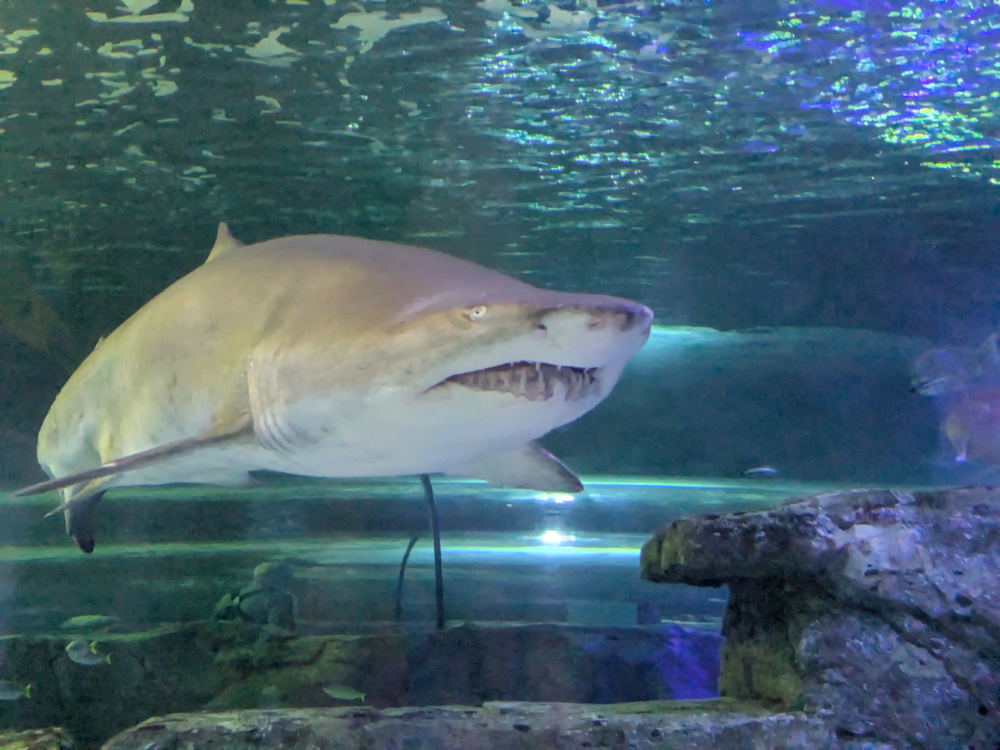
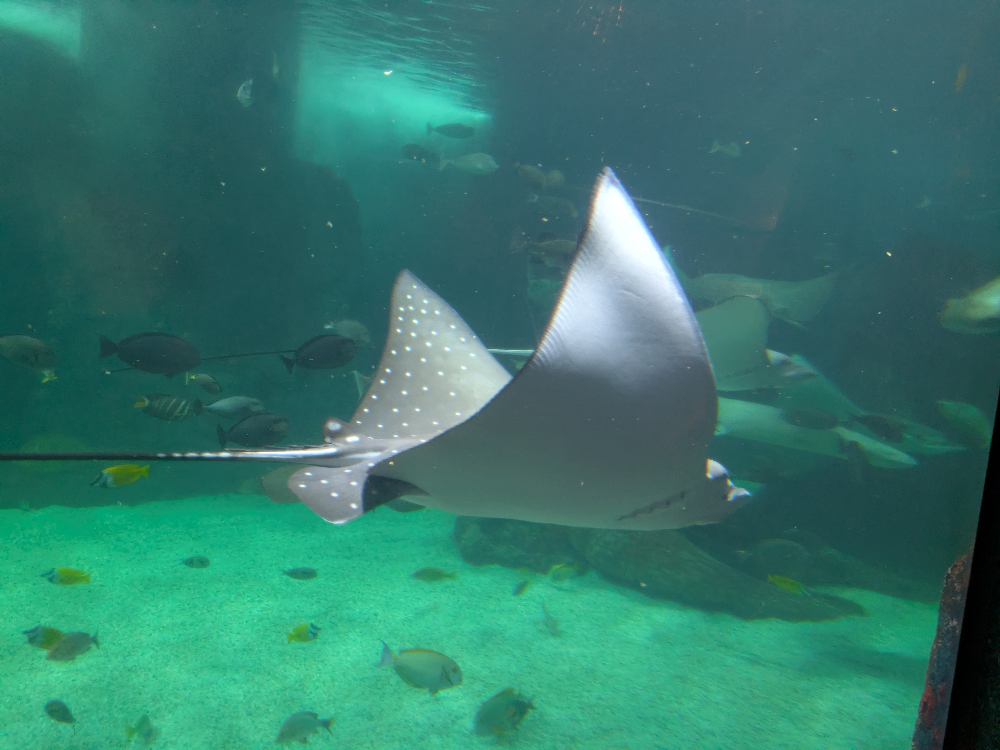
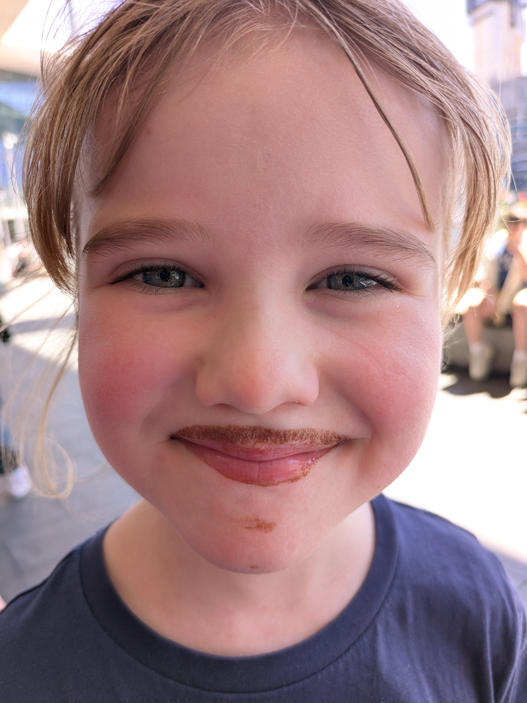

With no pressure to be somewhere (at least not a place that would leave without you) we got to sleep in and have a nice, long breakfast. As a nation of coffee lovers it was only natural that the breakfast contained its own barista bar. What we didn't think of was that of course they could make hot chocolate for the kids. So if anything, the kids are going to remember the breakfast buffet because of the hot chocolate drinks. Not to mention that they had a pancake machine where all you need to do was press a button an pancakes came out on a conveyor belt. It's amazing the kids are happy going back to regular, old breakfasts after this.

## Sea Life Aquarium - a better aquarium

I might have mentioned it in some post at some time, but the aquarium in Melbourne is a little lacking. Not necessarily bad, but it could be better. And seeing as the same company runs the aquarium in Sydney I wasn't sure what to expect. Thankfully the aquarium in Sydney is more what an aquarium should be. To give an example of what I mean, the penguin display in Melbourne is small. It seems like the poor penguins are all crowded into a small space and it also isn't well optimized for the people either. Indeed, they have a 4D video with clips from Happy Feet instead of prioritizing the actual animal exhibit. I'm not sure what constraints caused this, but it just feels like a missed opportunity. Anyway, the aquarium in Sydney is not like this at all. In fact, it had a great habitat for a Dugong (better known as a sea cow). Dugongs aren't a threatened species so all the specimens that are in captivity are they because they would not survive on their own. Indeed, there are only 3 Dugongs in aquariums around the world. Fun fact, the largest population of Dugongs are in Australia along the Great Barrier Reef and as long as that area i protected the Dugongs shouldn't be threatened. They are considered vulnerable as they take time reproduce with a female only giving birth to a single calf every 3-7 years. Without protected areas to live, like they have in Australia, the Dugongs could easily become threatened by extinction. Thankfully, we humans have moved on from such things.

## Chinatown

Chinatown

There was of course more to see in aquarium than just a Dugong, but for us that was probably the highlight. I forgot to mention the aquarium was just a 10 minute walk from our hotel, so after we were done and had some lunch* we headed back to get out of the heat. As Sydney is a lot warmer than Melbourne we are not acclimatized to heat yet. It is getting warmer in Melbourne, but Sydney felt more like summer. Indeed, the weekend before we arrived it hit 30C degrees (86F), but thankfully it cooled down a few degrees the week were there. So once the brunt of the heat subsided we headed to Chinatown. It's not a huge Chinatown, but there are the classic gates and a few statues. Since we kind of live in the unofficial Chinatown of Melbourne it felt more like home. After picking up some more Asian foods from different vendors and the kids not really enjoying any of them, we picked up some burgers on our way back to the hotel and called it a night.

\* For lunch what can only be described as one interesting hotdog. It was in essence a chili dog, with quite the kick to it, and the hotdog itself was on a bed of mushy peas. Very interesting combination!

