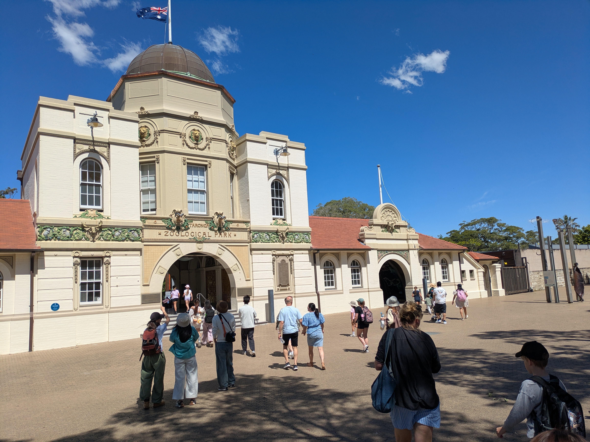
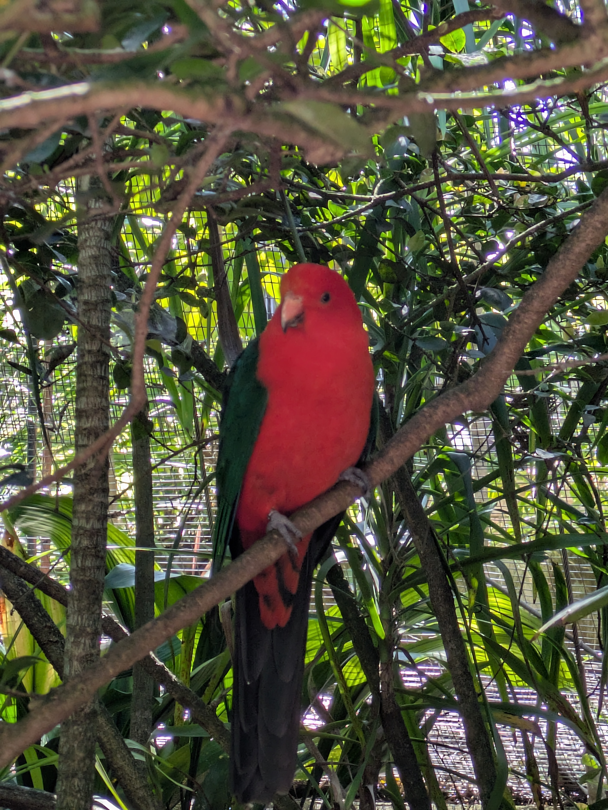
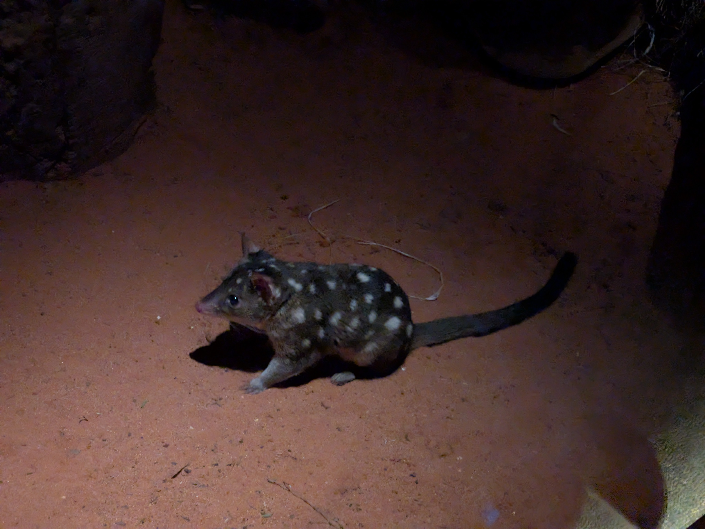
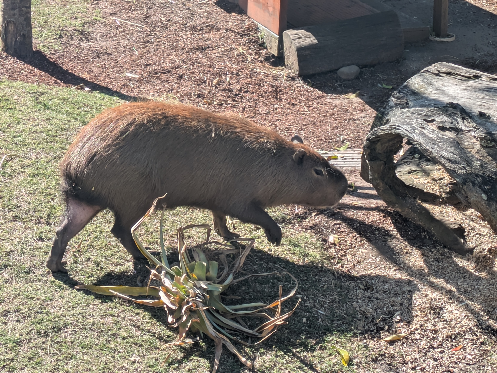
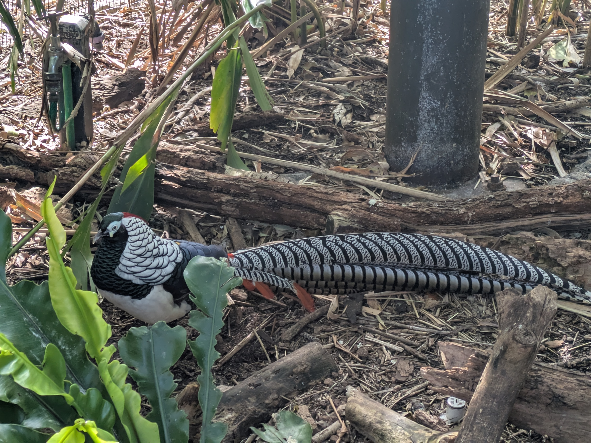

Another day of tourism ahead of us. This time it we were heading to the zoo. Sydney has two zoo's, but we were specifically heading to the Taronga Zoo, which is across the bay from Circular Quay. That means you can take a boat to get there. Of course, with the whale cruise fresh in mind, Isabelle was apprehensive about another boat ride. Thankfully you only cross the bay which is quite sheltered and the trip is only about 10 minutes long. So no sea sickness, thankfully.

## A zoo from top to bottom

Once we disembark the boat we were met with a shuttle bus to the main entrance of the zoo. As was explained by the person directing confused tourists onto the bus, the zoo is built into the hillside and so you want to start at the top and work your way back down to the dock. Sound advice! A quick bus trip later and we headed in through the old timey gates of the zoo. Just like the zoo here in Melbourne, it is a large complex and we realized we weren't going to see it all in one day. So we skipped a few of the exhibits, mostly things that we are accustomed to seeing here in Melbourne. One thing that is different at Taronga zoo is that they have several aviaries. In Melborune they have one, rather large aviary. But here they split the bird life into several categories, like the wet land aviary, the Australian rain forest and a special Blue Mountains aviary (for those that don't know, the Blue Mountains National Park is situated about an hours drive outside Sydney). We also found separate nocturnal creates zone which gave a good view of creates that normally don't show themselves much (at least not during the day). And there were some more specialty Australian creates like the Tasmanian Devil echidnas. Funny enough the echidnas were put in the 'farm' zone which showcased more domestic animals. Think goats, bunnies, chicken and sheep. And a few alpacas for good measure. 

## Avoiding school groups

As this was term break for schools in New South Wales as well, we spent the day trying to avoid larger groups of school kids. Not that it was a big problem, but there were instances were we decided to go the other direction because a larger group of school kids were going where we were thinking of going. They have the same type of program in Melbourne too, and one of the activities is going to the zoo, but for us it doesn't make sense paying for after-school care when we don't have jobs to worry about anyway. Anyway, with a few evasive manoeuvres we enjoyed the day out. We also got to see a capybara, a sun bear and two pygmy hippos. There was more, of course, but listing everything would take too much space on the page. Those were the highlights for us. As the day went on we could tell the wind was picking up, but that wasn't the biggest problem on our return. As we just missed the 3.12PM boat back, we had to wait 20 minutes on the docks for the next boat. And the dock would not stop filling up with people to the point were I would have thought the boats capacity would be reached. No one was left behind as far as I could see, but it did feel like a fight to get on the boat on our return. After a somewhat more bumpy ride back we just got takeout and crashed at our hotel. A long day in the sun had taken it out of us for sure.

