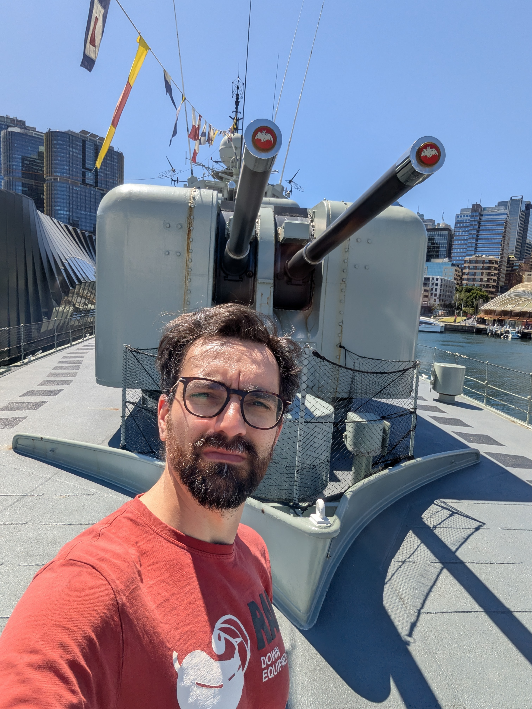
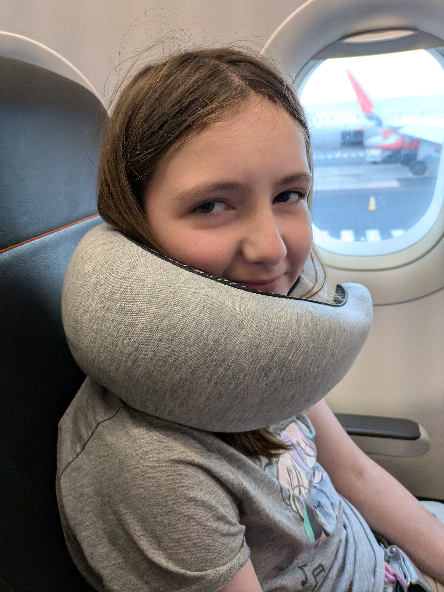

Last day in Sydney. Before we headed home though we had another day to fill with something. This day wasn't planned like the others, but since we had seen the National Maritime Museum (or MuSEAum as they called it) across the bay at Darling Harbour we figured that might be something. And it turned out they had a collection of vessels that you could board. Sadly the submarine was not open for tourists this day, but we headed onto the HMAS Vampire, the Endeavour and the Duyfken. The first one was a military destroyer from the post WW2-era. And since Australia didn't fight any naval battles after WW2 the ship had never seen combat. That meant of course the it was intact and worked perfectly as a museum piece. The Endeavour and the Duyfken were both replicas, the first being the ship James Cook used when he 'discovered' Australia. Of course, Cook didn't set out to colonize Australia. That only happened after his return, but if it wasn't for Cook and his voyage it isn't certain the British Empire would have set foot on Australia. The second vessel, the Duyfken, is actually the first recorded landing of Europeans in Australia. This was back in 1606, so a good 150 years before Cook. It was a Dutch trading vessel that would trade in spices and other high-value, but low volume cargo. Why the Dutch didn't pursue Australia as a colony is probably due to the lack of natural resources they found on the coast. It is only really in modern day that the mining industry has taken off here in Australia, and mainly due to more modern valuable ore like lithium. So back in the good old days when they didn't need that sort of thing Australia wasn't really all to interesting. I mean, Britain mainly just sent people they wanted to get rid of so that should tell you all you need to know about the country.

## Time to leave

Before we headed to airport we went back to Tumbalong Park one last time. Sadly, the park was overrun with people. We had seen people at our hotel that were part of some space convention and it seems this Friday they were hosting something in the park for families. The International Convention Centre Sydney happens to be on the one side of the park, and now they had spilled into the park with exhibits of some kind. It was so crowded and we were quite tired (not to mention hungry) that we couldn't begin to check it out. Thankfully we walked further along, back to where we picked up our burgers the other night. There we found it lot less crowded and we got some lunch before we had to head back to the hotel to pick up our luggage and get a ride to the airport. Sydney's domestic terminal is certainly no better or worse than Melbourne although we had been warned by the airline to meet up with plenty of time due to construction going on at the terminal. After we drop our bags we got to go through the assisted line at security so we did save maybe 5-10 minutes there. But seeing the barriers set up to funnel people into security I would say that we came at a low point of the day. The flight was completely full though, so I guess a Friday evening might not be the best time to go between Australia's two biggest cities. Sadly our flight was both late getting out of Sydney, and delayed on arrival at Melbourne so we ended up getting home much later than planned. Thankfully it didn't matter much as we have the weekend at home to get ready for the week ahead.

