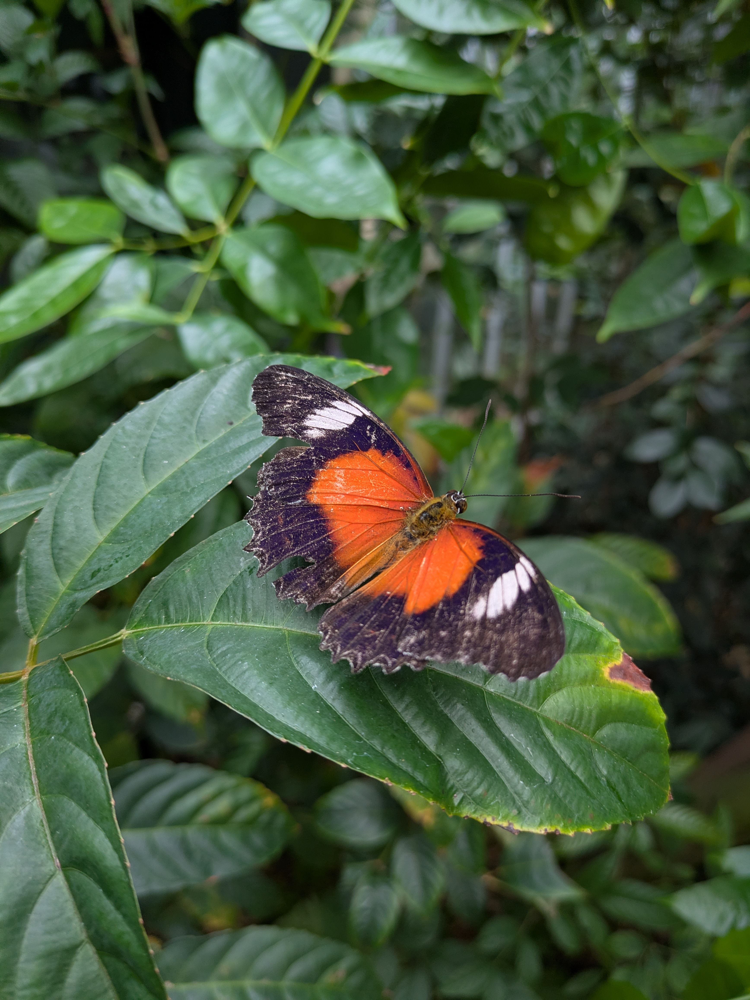

As I mentioned in my last post, the kids have a break from school. And when it's term break you can always count on the zoo for entertainment. And don't you know it! They are having a special event based on How To Train Your Dragon. There is a reason for this though. Victorian Grassland Earless Dragon was believed extinct until rediscovered in 2023. Naturally, this dragon has nothing in common with the dragons of How To Train Your Dragon, but its a good enough excuse to promote the conservation of the Victorian Grassland Earless Dragon.

## A Viking training grounds and scavenger hunt

For some added activity they had a Viking training ground where kids could pretend to train as the Vikings of Berk. From identifying different categories of dragon to balancing on beams you got to test your skill in several disciplines. After that it was on to a scavenger hunt to find the letters needed to solve the mystery word puzzle. And at the end of the scavenger hunt they gave out free viking helmets to all who completed it! Quite a bit of extra fun along with all the normal things you can do at the zoo. Oh, and they had some fun viking themed items on the menu as well.

## The Little Penguin (that could)

We figured we hadn't seen the seals and penguins at the zoo in a while so we headed into the marine part of the zoo. One thing I didn't realize was that the penguins they have at the zoo are all of the 'Little Penguin' variety. For those who don't remember, or have not read the post, these are the same type of penguin that have their colony on Phillip Island (check out the part 1 post). So the penguins at the zoo are rescued animals of the same species, and so it might be that one of the penguins at the zoo might have lived on Phillip Island! Funny to think about, although I would guess the penguin would have preferred to not have ended up at the zoo. Or maybe they enjoy being in captivity so they don't have to work so hard to find food. Who knows the mind of a penguin?

