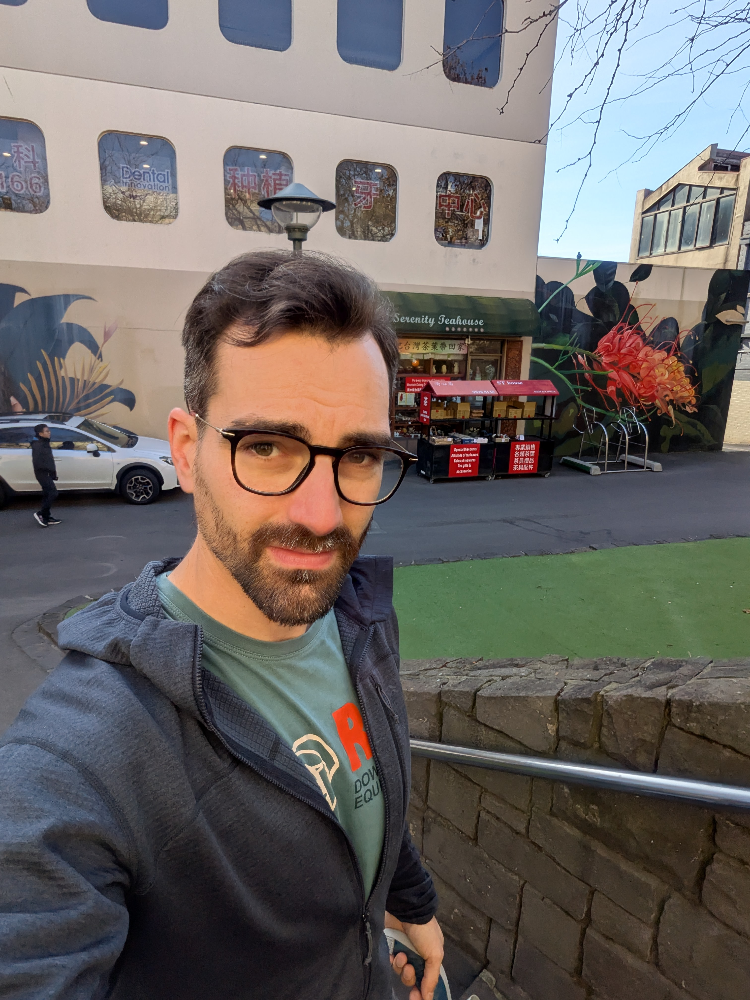
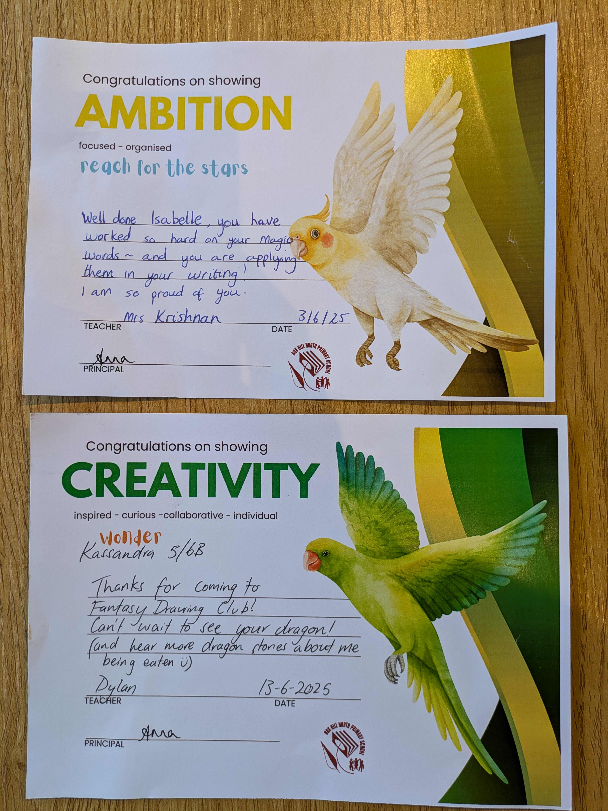

It's been a few weeks since my last update, but that doesn't mean things haven't been going on. Quite the opposite. Anna has now completed her first trimester and the girls are excelling in school, both socially and academically. And Anna and I even celebrated our 10th wedding anniversary!

## Just in time for the next vacation

The next school break is only two weeks away. As they do three months (or so) of school and a two week break, we are already fast approaching the end of term 2. Of course, while the rest of the world normally has summer holiday it is currently "winter" here and so it's just a normal school break. Yes, I put winter i quotes because it is more like a nice fall day most of the time. Just the other day it was 16\*C (60\*F) and we are pretty much in mid-winter here. Granted most days are not that warm, but statistically it only rains about 50% of the time in June and July so it certainly doesn't feel much like fall either. Indeed the birthday parties that Isabelle has been invited too have all been outside, in public parks and those were fine. So yeah, no winter to speak of really. Anyway, the girls have settled in nicely at school. Kassandra has a drawing club that she does on Thursdays (see her Dragon picture below) and Isabelle is catching up to her classmates with reading and writing. They both got recognition's for their efforts at assembly a week back, so they are certainly starting to feel at home. And like I said, just in time for the next vacation!

## So what does a $10 haircut look like?

Maybe the biggest reason I have not posted in a few weeks is that I have got stuck into my project. For those who don't know I hope to succeed as an indie app developer (indie is short for independent). Currently I have my first app in closed testing and if all goes well it will be on the Google Play Store in a weeks time. And I have several more apps in the works. Some are simple and will be free to use, while the more complex I will have some sort of paid option. My strategy for success is simple. Provide value by solving real world problems. And to make sure I at least solve one persons problems my main focus are my own problem. By making my life easier I am certain I can help others as well. And they will hopefully be grateful enough to pay for that service. Oh, and if you wonder what a $10 haircut looks like my after-selfie is below. And those are Aussie dollars and not proper greenbacks so that's more like a $6.50 for a haircut.

